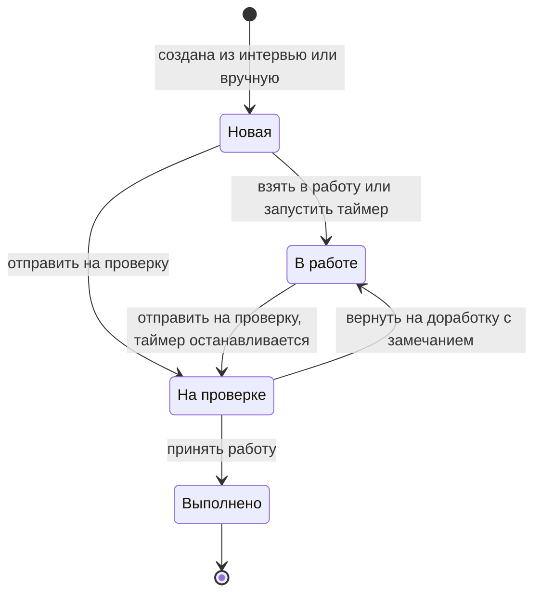

# Разбор кода: CRM системного аналитика

Это «перевод кода на русский» — учебный разбор проекта `C:\Projects\CRM`. Документ написан для владельца проекта,
который хорошо понимает предметную область (интервью, требования, процессы, KPI), но почти не программировал.
Цель простая: открыть файл с кодом, найти любое место и понимать, **что** там происходит, **зачем** это нужно
и **какой приём** использован.

## Как читать этот документ

- Разделы про код идут **в том же порядке, что и в файлах**. Название раздела совпадает с именем в коде
  (функции, класса, константы). Чтобы найти место в файле, откройте его в редакторе, нажмите **Ctrl+F** и вставьте имя,
  например `def split_theses` или `SCHEMA =`. Номера строк намеренно не указаны — они меняются при каждой правке.
- Базовые понятия (HTTP, SQL, JSON, регулярные выражения и т. д.) объясняются **в момент первого появления**
  во врезках вида:

  > **Понятие.** Короткое объяснение с житейской аналогией.

- Фрагменты кода короткие, с построчными комментариями на русском. Комментарии после `#` (Python) или `//` (JavaScript)
  добавлены для этого документа — в самом коде их может не быть.
- Если хочется «просто понять идею», читайте раздел 1, раздел 4 (разбор интервью), раздел 5 (KPI), раздел 8 (BPMN)
  и «Словарь терминов» в конце.

## Содержание

1. [Как устроено приложение целиком](#1-как-устроено-приложение-целиком)
2. [main.py: шапка, настройки, база данных](#2-mainpy-шапка-настройки-база-данных)
3. [main.py: вспомогательные функции и логирование](#3-mainpy-вспомогательные-функции-и-логирование)
4. [main.py: разбор интервью в задачи](#4-mainpy-разбор-интервью-в-задачи)
5. [main.py: KPI и качество](#5-mainpy-kpi-и-качество)
6. [main.py: шаблоны страниц (HTML, CSS, JavaScript)](#6-mainpy-шаблоны-страниц-html-css-javascript)
7. [main.py: маршруты (обработчики запросов)](#7-mainpy-маршруты-обработчики-запросов)
8. [bpmn_gen.py: генератор BPMN-схем](#8-bpmn_genpy-генератор-bpmn-схем)
9. [Жизненный цикл задачи и канбан как бизнес-правила](#9-жизненный-цикл-задачи-и-канбан-как-бизнес-правила)
10. [Демо-режим и защита от ботов](#10-демо-режим-и-защита-от-ботов)
11. [tests/test_crm.py: автотесты](#11-teststest_crmpy-автотесты)
12. [Словарь терминов](#12-словарь-терминов)
13. [Проверь себя](#13-проверь-себя)
14. [Что можно улучшить дальше](#14-что-можно-улучшить-дальше)

---

## 1. Как устроено приложение целиком

### 1.1. Файлы проекта

| Файл | Что это | Размер (порядок) |
|---|---|---|
| `main.py` | Всё веб-приложение: настройки, база данных, логика, HTML-шаблоны страниц, обработчики запросов | ~2900 строк |
| `bpmn_gen.py` | Отдельный модуль: превращает описание процесса на русском языке в BPMN 2.0 XML с координатами | ~460 строк |
| `tests/test_crm.py` | Автотесты: сами «кликают» по приложению и проверяют результат | ~200 строк |
| `crm.db` | Файл базы данных SQLite (создаётся при первом запуске) | — |
| `crm.log` | Технический журнал (лог-файл) | — |
| `project_data.json` | Данные старой версии CRM (с занятия 07.09) — переносятся в базу один раз | — |
| `original_main_07-09.py` | Исходная версия с занятия: задачи хранились в JSON-файле, одна страница | ~490 строк |
| `requirements.txt` | Список библиотек: только `flask>=3.0` | — |
| `run.bat` | Запуск двойным щелчком в Windows | — |

Всё, что видит пользователь в браузере (HTML-разметка, стили CSS, скрипты JavaScript), тоже лежит в `main.py` —
в виде больших текстовых строк-шаблонов (`LAYOUT`, `INDEX`, `INTERVIEWS` и т. д.). Это необычно для крупных проектов,
но удобно для учебного: один файл — одно приложение.

### 1.2. Три участника: браузер, сервер, база

```
 ┌───────────────────────────┐        HTTP-запрос         ┌──────────────────────────────┐        SQL         ┌────────────────┐
 │         БРАУЗЕР           │  ───────────────────────►  │      СЕРВЕР  (Python)        │  ───────────────►  │   БАЗА SQLite  │
 │  Chrome / Edge / Firefox  │   GET /tasks               │  Flask-приложение  main.py   │  SELECT ... FROM   │    crm.db      │
 │                           │   POST /task/add  {JSON}   │                              │  INSERT INTO ...   │                │
 │  HTML  — что показать     │                            │  маршрут (@app.route) ──►    │                    │  таблицы:      │
 │  CSS   — как выглядит     │  ◄───────────────────────  │  функция-обработчик ──►      │  ◄───────────────  │  employees     │
 │  JS    — как реагирует    │      HTTP-ответ            │  шаблон Jinja / JSON         │   строки таблиц    │  interviews    │
 │         на клики          │   HTML-страница или JSON   │                              │                    │  tasks, ...    │
 └───────────────────────────┘                            └──────────────────────────────┘                    └────────────────┘
            ▲                                                          │
            │   библиотеки с CDN (из интернета):                       ├──► bpmn_gen.py  (генерация BPMN XML)
            │   Bootstrap, Bootstrap Icons, Chart.js, bpmn-js,         ├──► crm.log      (технический журнал)
            └── шрифт Inter (Google Fonts)                             └──► таблица events (журнал для людей)
```

> **Понятие. Клиент и сервер.** Как в ресторане: посетитель (клиент — браузер) не ходит на кухню, он передаёт заказ
> официанту. Кухня (сервер) готовит блюдо и отдаёт его обратно. Склад продуктов — это база данных: кухня берёт оттуда
> и кладёт туда, посетитель склад вообще не видит.

> **Понятие. HTTP-запрос и ответ.** HTTP — язык, на котором браузер и сервер обмениваются сообщениями. Каждое общение —
> пара «запрос → ответ», как письмо и ответное письмо. В запросе есть **метод** (что хотим сделать), **адрес**
> (например, `/tasks`), **заголовки** (служебные сведения) и иногда **тело** (данные). В ответе — **код статуса**
> (`200` — всё хорошо, `404` — не найдено, `400` — ошибка в запросе, `500` — сбой на сервере, `429` — слишком много
> запросов) и **тело** (HTML-страница, JSON, файл). После ответа сервер «забывает» разговор: следующий запрос —
> новое письмо.

> **Понятие. GET и POST.** Два главных метода HTTP. **GET** — «покажи мне» (открыть страницу, получить данные);
> такой запрос не должен ничего менять. **POST** — «сделай» (создать задачу, сменить статус); данные передаются
> в теле запроса. Аналогия: GET — посмотреть витрину, POST — оформить заказ. В этой CRM все изменения идут только
> через POST, а все страницы открываются через GET.

> **Понятие. Flask.** Библиотека (фреймворк) для Python, которая берёт на себя всю «почтовую» работу: принимает
> HTTP-запросы, решает, какой функции их отдать, и превращает результат функции в HTTP-ответ. Программисту остаётся
> написать функции-обработчики.

### 1.3. Карта маршрутов

> **Понятие. Маршрут (`@app.route`).** Это табличка «адрес → кто обслуживает». Запись
> `@app.route("/tasks")` над функцией `index` означает: «если пришёл запрос на адрес `/tasks`, вызвать `index()`».
> Знак `@` в Python называется **декоратор** — он «навешивает» на функцию дополнительное поведение, здесь — регистрирует
> её в таблице маршрутов Flask. Часть адреса в угловых скобках, например `/task/<int:task_id>/timer`, — переменная:
> из адреса `/task/15/timer` Flask достанет число 15 и передаст его в функцию как `task_id`.

Все маршруты `main.py` (поиск по имени функции):

| Метод | Адрес | Функция | Что делает |
|---|---|---|---|
| GET | `/` | `dashboard` | Дашборд: карточки-показатели, графики, ближайшие сроки, события |
| GET | `/tasks` | `index` | Список задач с фильтрами |
| POST | `/task/add` | `task_add` | Создать задачу вручную |
| POST | `/task/<id>/timer` | `task_timer` | Запустить / остановить таймер |
| POST | `/task/<id>/status` | `task_status` | Отправить на проверку |
| POST | `/task/<id>/review` | `task_review` | Принять работу или вернуть на доработку |
| POST | `/task/<id>/assign` | `task_assign` | Сменить исполнителя |
| POST | `/task/<id>/delete` | `task_delete` | Удалить задачу |
| POST | `/task/<id>/take` | `task_take` | Взять в работу (канбан: «Новые» → «В работе») |
| GET | `/check` | `check` | Список просроченных задач в JSON (кнопка «Проверить актуальность») |
| GET | `/interviews` | `interviews_page` | Страница интервью: форма и архив |
| POST | `/interviews/parse` | `interviews_parse` | Разобрать протокол на задачи (без сохранения — предпросмотр) |
| POST | `/interviews/save` | `interviews_save` | Сохранить интервью и создать задачи |
| GET | `/interviews/<id>` | `interview_view` | Карточка одного интервью |
| POST | `/demo/reset` | `demo_reset` | Сбросить демо-данные |
| GET | `/employees` | `employees_page` | Сотрудники |
| POST | `/employees/add` | `employees_add` | Добавить сотрудника |
| POST | `/employees/demo` | `employees_demo` | Заполнить демо-командой из 8 человек |
| POST | `/employees/<id>/status` | `employees_status` | Статус «работает / больничный / отпуск» и период |
| POST | `/employees/<id>/delete` | `employees_delete` | Удалить сотрудника |
| GET | `/kpi` | `kpi_page` | KPI сотрудников, отделов, журнал проверок |
| GET | `/log` | `log_page` | Журнал событий с фильтром и поиском |
| GET | `/log.csv` | `log_csv` | Выгрузка журнала в CSV (открывается в Excel) |
| GET | `/kanban` | `kanban` | Канбан-доска |
| GET | `/bpmn` | `bpmn_page` | Редактор BPMN-схем |
| POST | `/bpmn/generate` | `bpmn_generate` | Построить схему (из алгоритма, интервью, шаблона) |
| POST | `/bpmn/<id>/save` | `bpmn_save` | Сохранить схему после правки мышкой |
| POST | `/bpmn/<id>/delete` | `bpmn_delete` | Удалить схему |
| GET | `/bpmn/<id>.bpmn` | `bpmn_download` | Скачать схему файлом `.bpmn` |

Закономерность, полезная для аналитика: **GET-маршруты возвращают HTML-страницы**, **POST-маршруты возвращают JSON**
вида `{"success": true, ...}` или `{"success": false, "error": "текст"}`. Страница после успешного POST обычно
перезагружается и заново запрашивает данные через GET.

> **Понятие. JSON.** Текстовый формат для передачи данных между программами. Выглядит как анкета:
> `{"title": "Сделать форму", "priority": "высокий", "estimate_hours": 6}` — фигурные скобки означают «объект»
> (набор пар «поле: значение»), квадратные `[...]` — список. JSON понимают и Python, и JavaScript, поэтому это
> общий язык браузера и сервера. В Python JSON превращается в словарь (`dict`) и список (`list`).

### 1.4. Путь одного действия: «Сохранить интервью»

Проследим самый важный сценарий CRM от клика до записи в базу и обратно на экран.

```
 Аналитик                Браузер (JavaScript)                   Сервер Flask (main.py)                         База crm.db
    │                            │                                        │                                         │
    │ вставил протокол,          │                                        │                                         │
    │ нажал «Разобрать           │                                        │                                         │
    │ на задачи»  ─────────────► │ parseText()                            │                                         │
    │                            │ api('/interviews/parse', {text})       │                                         │
    │                            │ ── POST /interviews/parse  {JSON} ───► │ interviews_parse()                      │
    │                            │                                        │  split_theses → classify →              │
    │                            │                                        │  detect_priority → extract_deadline →   │
    │                            │                                        │  make_title → pick_employee             │
    │                            │                                        │  (читает сотрудников и загрузку) ─────► │ SELECT
    │                            │ ◄── {"success": true, "items": [...]} ─│  НИЧЕГО НЕ СОХРАНЯЕТ                     │
    │                            │ рисует таблицу предпросмотра (DOM)     │                                         │
    │ ◄───────────────────────── │                                        │                                         │
    │ поправил отделы/сроки,     │                                        │                                         │
    │ снял лишние галочки,       │                                        │                                         │
    │ нажал «Сохранить…» ──────► │ saveTasks()                            │                                         │
    │                            │ собирает отмеченные строки             │                                         │
    │                            │ ── POST /interviews/save  {JSON} ────► │ interviews_save()                       │
    │                            │                                        │  проверки и лимиты                      │
    │                            │                                        │  INSERT INTO interviews ──────────────► │
    │                            │                                        │  для каждой задачи:                     │
    │                            │                                        │    resolve_employee, INSERT INTO tasks ►│
    │                            │                                        │    log_event → INSERT INTO events ────► │
    │                            │                                        │  interview_diagram → bpmn_gen →         │
    │                            │                                        │    INSERT INTO diagrams ──────────────► │
    │                            │                                        │  db.commit()  — «всё или ничего» ─────► │ запись на диск
    │                            │ ◄── {"success": true, "interview_id": 3, "created": 8, "diagram_id": 7}         │
    │                            │ всплывающее уведомление,               │                                         │
    │                            │ через 0,9 с переход на                 │                                         │
    │                            │ ── GET /tasks?interview=3 ───────────► │ index()  → all_tasks() ───────────────► │ SELECT … JOIN
    │                            │ ◄──────────── HTML-страница ────────── │ render_template("index.html", …)        │
    │ ◄──── видит новые задачи ──│                                        │                                         │
```

Что важно заметить:

1. **Два запроса, а не один.** Сначала разбор (предпросмотр), потом сохранение. Это бизнес-решение: автоматическая
   классификация может ошибиться, поэтому человек проверяет результат *до* записи в базу.
2. **Сервер ничего не помнит между запросами.** Во второй запрос браузер заново отправляет весь текст и все задачи.
3. **Транзакция.** Интервью, задачи, записи журнала и BPMN-схема сохраняются одним `commit()`. Если на середине
   что-то пошло не так (например, указан несуществующий сотрудник), выполняется `rollback()` — и в базе не остаётся
   «половинки» интервью. Подробнее — в разделе 2.5.
4. **После записи — перезагрузка страницы.** Новая страница строится с нуля по свежим данным из базы.

### 1.5. Как CRM живёт на сайте портфолио

Локально CRM запускается сама по себе: `python main.py` → `http://127.0.0.1:5000`. В интернете (PythonAnywhere) на одном
сайте живут несколько проектов: витрина, магазин «ВИНЧЕСТЕРЪ» и CRM по адресу `/crm/`. Это делает файл
`C:\Projects\portfolio\portal.py` (и `pythonanywhere_wsgi.py`, который его вызывает).

> **Понятие. WSGI.** Стандартная «розетка» между веб-сервером и Python-приложением. Веб-сервер (на хостинге) умеет
> принимать соединения из интернета, а Python-приложение умеет обрабатывать запросы. WSGI описывает, как одно
> подключается к другому: приложение — это функция, которой передают описание запроса (`environ`) и способ отправить
> ответ (`start_response`). Flask-приложение `app` как раз такая «вилка».

> **Понятие. DispatcherMiddleware.** «Middleware» — прослойка между сервером и приложением. `DispatcherMiddleware`
> работает как секретарь на ресепшене бизнес-центра: смотрит на начало адреса и направляет посетителя в нужный офис.
> `/crm/...` → приложение CRM, `/winchester/...` → магазин, всё остальное → витрина.

```
Интернет ──► веб-сервер хостинга ──► PostRateLimit ──► DispatcherMiddleware ──┬─ "/crm"        → main.py (CRM)
                                    (ограничение      (распределение по     ├─ "/winchester" → магазин
                                     частоты POST)     префиксу адреса)      └─ остальное     → витрина portal.py
```

Ключевые места:

- `build_application` в `portal.py`: `PostRateLimit(DispatcherMiddleware(app.wsgi_app, mounts))` — сначала
  проверка частоты, потом распределение.
- Когда CRM открыта по адресу `/crm/tasks`, Flask внутри CRM видит путь `/tasks`, а префикс `/crm` кладёт
  в `request.script_root`. Поэтому все ссылки в шаблонах пишутся как `{{ root }}/tasks`, а в JavaScript — `ROOT + url`.
  Без этого ссылки вели бы на `/tasks` витрины, а не CRM.
- `PostRateLimit` — защита от ботов (подробно в разделе 10).
- В `pythonanywhere_wsgi.py` включается демо-режим (`CRM_DEMO=1`) и часовой пояс Самары, потому что сервер хостинга
  живёт по UTC, а «сегодня» и сроки задач нужно считать по местному времени.

---

## 2. main.py: шапка, настройки, база данных

### 2.1. Описание модуля (docstring в начале файла)

Файл начинается со строки в тройных кавычках `"""..."""`. Это **docstring** — встроенное описание модуля.
Python его не выполняет, это документация для человека: что добавлено в версии 2.0 по сравнению с CRM
с занятия 07.09 и как запускать (`python main.py -> http://127.0.0.1:5000`).

### 2.2. Импорты

> **Понятие. Импорт.** `import` подключает готовый код — библиотеку. Как в юриспруденции ссылка на кодекс вместо
> переписывания статьи: не нужно заново изобретать работу с датами или базой данных.

| Импорт | Откуда | Зачем в CRM |
|---|---|---|
| `csv`, `io` | стандартная библиотека | Выгрузка журнала в CSV-файл (`log_csv`) |
| `json` | стандартная | Чтение старого `project_data.json` |
| `logging`, `RotatingFileHandler` | стандартная | Технический журнал `crm.log` с ротацией |
| `os`, `sys` | стандартная | Пути к файлам, переменные окружения, аргументы запуска |
| `re` | стандартная | Регулярные выражения — разбор текста интервью |
| `sqlite3` | стандартная | Работа с базой SQLite |
| `webbrowser`, `Timer` | стандартная | Открыть браузер через 1,5 секунды после запуска |
| `datetime, date, timedelta` | стандартная | Даты, сроки, «через 2 недели» |
| `Flask, render_template, request, jsonify, g, abort, Response` | Flask | Веб-приложение, шаблоны, данные запроса, JSON-ответы, «рюкзак» запроса `g`, ошибка 404, произвольный ответ (файл) |
| `DictLoader` | Jinja2 (идёт с Flask) | Брать шаблоны из словаря строк, а не из папки `templates` |
| `HTTPException` | Werkzeug (идёт с Flask) | Отличать «штатные» HTTP-ошибки (404) от настоящих сбоев |
| `bpmn_gen` | свой модуль | Генератор BPMN-схем |

Обратите внимание: из внешних библиотек нужен только Flask. Всё остальное — стандартная библиотека Python,
она ставится вместе с Python. Поэтому в `requirements.txt` одна строка.

### 2.3. Настройки и константы

```python
app = Flask(__name__)                                        # само веб-приложение
BASE_DIR = os.path.dirname(os.path.abspath(__file__))        # папка, где лежит main.py
DB_FILE = os.environ.get("CRM_DB") or os.path.join(BASE_DIR, "crm.db")  # путь к базе: из окружения или по умолчанию
PORT = 5000                                                   # порт локального сервера

DEPARTMENTS = ["Frontend", "Backend", "Architecture", "Security"]        # справочник отделов
PRIORITIES = ["высокий", "средний", "низкий"]                            # справочник приоритетов
PRIORITY_DAYS = {"высокий": 3, "средний": 7, "низкий": 14}               # срок по умолчанию, дней
DEPT_HOURS = {"Frontend": 6, "Backend": 8, "Architecture": 4, "Security": 4}  # оценка по умолчанию, часов
EMP_STATUSES = ["работает", "больничный", "отпуск"]
DEMO_MODE = os.environ.get("CRM_DEMO") == "1"                 # включён ли демо-режим
app.config["MAX_CONTENT_LENGTH"] = 256 * 1024                 # запрос больше 256 КБ отклоняется
```

- **Константы** пишутся ЗАГЛАВНЫМИ буквами — это договорённость программистов: «значение задано один раз и не
  меняется во время работы». Справочники отделов и приоритетов собраны в одном месте, поэтому добавить пятый отдел —
  значит поправить несколько констант, а не искать слово по всему коду.
- `PRIORITY_DAYS` и `DEPT_HOURS` — **бизнес-правила по умолчанию**: срочная задача по умолчанию получает 3 дня,
  бэкенд-задача — оценку 8 часов. Аналитик может поправить их в предпросмотре.
- `DEMO_LIMITS` — потолки записей в демо-версии (подробно в разделе 10).
- `MAX_CONTENT_LENGTH` — если кто-то пришлёт запрос больше 256 КБ, Flask сам ответит ошибкой 413 и даже не станет его
  читать. Простая защита от «забивания» сервера.
- `EXAMPLE_INTERVIEW` и `DEMO_VOICE_INTERVIEW` — готовые тексты протоколов для кнопки «Вставить пример» и демо-данных.

> **Понятие. Переменная окружения.** Настройка, которую задают *снаружи* программы при запуске, а не в коде.
> Как записка для сотрудника на смену: код один и тот же, а поведение разное. `CRM_DB` задаёт путь к базе
> (тесты подставляют временный файл, чтобы не испортить рабочую базу), `CRM_DEMO=1` включает демо-режим на хостинге,
> `CRM_LOG` и `CRM_LOG_LEVEL` управляют журналом. `os.environ.get("CRM_DB")` читает такую настройку; если её нет —
> получаем `None`, и срабатывает запасной вариант после `or`.

### 2.4. База данных: `SCHEMA`

> **Понятие. База данных и таблицы.** База данных — это картотека, в которой данные хранятся упорядоченно и
> переживают перезапуск программы. Реляционная база (SQLite — одна из них) состоит из **таблиц**: каждая таблица —
> как лист Excel с жёстко заданными столбцами. **Строка** — одна запись (одна задача), **столбец** — одно свойство
> (срок, статус). SQLite хранит всю базу в одном файле `crm.db` и не требует отдельного сервера — поэтому её удобно
> использовать в учебных и небольших проектах.

Константа `SCHEMA` — это текст на языке SQL, описывающий все таблицы. Разберём главную — `tasks`:

```sql
CREATE TABLE IF NOT EXISTS tasks (                  -- создать таблицу, если её ещё нет
    id               INTEGER PRIMARY KEY AUTOINCREMENT,  -- номер задачи, база выдаёт сама: 1, 2, 3…
    title            TEXT NOT NULL,                  -- название; NOT NULL = обязательно
    description      TEXT NOT NULL DEFAULT '',       -- исходный тезис из интервью; по умолчанию пусто
    department       TEXT NOT NULL,                  -- отдел
    employee_id      INTEGER REFERENCES employees(id) ON DELETE SET NULL,   -- ссылка на исполнителя
    interview_id     INTEGER REFERENCES interviews(id) ON DELETE SET NULL,  -- из какого интервью
    priority         TEXT NOT NULL DEFAULT 'средний',
    deadline         TEXT NOT NULL,                  -- срок, текстом '2026-10-15'
    status           TEXT NOT NULL DEFAULT 'новая',  -- новая / в работе / на проверке / выполнено
    estimate_hours   REAL NOT NULL DEFAULT 4,        -- план в часах (REAL = дробное число)
    spent_seconds    INTEGER NOT NULL DEFAULT 0,     -- накопленное время по таймеру
    timer_started_at TEXT,                           -- когда запущен таймер (пусто, если не идёт)
    returns          INTEGER NOT NULL DEFAULT 0,     -- сколько раз возвращали на доработку
    created_at       TEXT NOT NULL,
    completed_at     TEXT                            -- когда принята работа
);
```

Все таблицы базы:

| Таблица | Что хранит | Ключевые поля |
|---|---|---|
| `employees` | Сотрудники | ФИО, отдел, должность, статус, период отсутствия `absent_from`–`absent_to` |
| `interviews` | Интервью со стейкхолдерами | тема, стейкхолдер, дата встречи, полный текст протокола, источник (`текст`/`голос`) |
| `tasks` | Задачи | см. выше |
| `reviews` | Журнал проверок качества | задача, результат (`принято`/`возврат`), комментарий |
| `diagrams` | BPMN-схемы | название, источник, связанное интервью, исходный текст алгоритма, XML схемы |
| `events` | Журнал событий для людей | время, уровень, действие, объект, сообщение |
| `meta` | Служебные пометки «ключ — значение» | например, `seeded_on` — дата последнего заполнения демо-данными |

Связи между таблицами (стрелка — «ссылается на»):

```
 employees ◄──── tasks.employee_id        (ON DELETE SET NULL: удалили сотрудника — задача осталась без исполнителя)
 interviews ◄─── tasks.interview_id       (ON DELETE SET NULL)
 interviews ◄─── diagrams.interview_id    (ON DELETE SET NULL)
 tasks ◄──────── reviews.task_id          (ON DELETE CASCADE: удалили задачу — удалились и её проверки)
```

> **Понятие. Первичный ключ (PRIMARY KEY).** Уникальный номер записи, как номер паспорта: по нему запись находится
> однозначно, двух одинаковых быть не может. `AUTOINCREMENT` — номер выдаёт сама база, по возрастанию.

> **Понятие. Внешний ключ (REFERENCES).** Ссылка из одной таблицы на запись другой. В задаче хранится не ФИО
> исполнителя, а его номер `employee_id`. Это как в договоре указать «Сторона 1 — см. реквизиты в приложении»:
> если сотрудник сменит фамилию, её достаточно поправить в одном месте. `ON DELETE` говорит, что делать со ссылкой,
> если запись, на которую ссылаются, удалили: `SET NULL` — очистить ссылку, `CASCADE` — удалить и зависимые записи.

> **Понятие. Индекс.** `CREATE INDEX idx_events_ts ON events (ts)` — алфавитный указатель в конце книги, только
> для базы. Журнал часто сортируется по времени, и индекс по полю `ts` позволяет не перебирать все строки.

Почему даты хранятся **текстом** вида `2026-10-15` и `2026-10-15T14:30:00`? В SQLite нет отдельного типа «дата», а
формат ISO 8601 (год-месяц-день) обладает полезным свойством: **при сортировке как текст он сортируется
хронологически**. Поэтому запросы вроде `ORDER BY ts DESC` или `WHERE ts >= '2026-09-29'` работают правильно.

### 2.5. Подключение к базе: `get_db`, `close_db`

```python
def get_db():
    if "db" not in g:                                  # в «рюкзаке» текущего запроса ещё нет соединения?
        g.db = sqlite3.connect(DB_FILE)                # открыть соединение с файлом базы
        g.db.row_factory = sqlite3.Row                 # строки результата — как словари: row["title"]
        g.db.execute("PRAGMA foreign_keys = ON")       # включить проверку внешних ключей (в SQLite по умолчанию выкл.)
    return g.db

@app.teardown_appcontext                               # Flask вызовет это в конце каждого запроса
def close_db(exc):
    db = g.pop("db", None)                             # достать соединение из «рюкзака»
    if db is not None:
        db.close()                                     # и закрыть
```

- `g` — это «рюкзак» одного запроса: Flask выдаёт новый пустой `g` на каждый запрос и выбрасывает его в конце.
  Приём «открыть соединение при первой необходимости, закрыть в конце запроса» — стандартный для Flask: соединение
  не открывается лишний раз и гарантированно закрывается.
- `PRAGMA foreign_keys = ON` — важная строка. Без неё SQLite *хранит* описания внешних ключей, но *не выполняет* их:
  `ON DELETE CASCADE` и `SET NULL` просто не сработали бы.
- `row_factory = sqlite3.Row` позволяет обращаться к полям по имени (`t["deadline"]`), а не по номеру столбца (`t[8]`).

> **Понятие. Транзакция, commit и rollback.** Изменения в базе сначала делаются «черновиком». `commit()` — подписать
> и сдать документ: все изменения записываются разом. `rollback()` — порвать черновик: база остаётся такой, какой была
> до начала. Главное свойство — **атомарность** («всё или ничего»): при сохранении интервью с восемью задачами
> не может получиться так, что записались четыре задачи, а остальные нет. В `main.py` каждый POST-обработчик в конце
> вызывает `db.commit()`, а при ошибке — `db.rollback()` (см. `interviews_save`, `handle_error`).

### 2.6. Демо-режим на входе запроса: `demo_daily_reset`, `over_demo_limit`

```python
@app.before_request                            # выполнить ПЕРЕД каждым запросом к CRM
def demo_daily_reset():
    if not DEMO_MODE:
        return                                 # в обычном режиме ничего не делаем
    db = get_db()
    row = db.execute("SELECT value FROM meta WHERE key = 'seeded_on'").fetchone()
    if not row or row["value"] != today().isoformat():   # демо-данные заполнялись не сегодня?
        seed_demo(db)                                     # вернуть всё к исходному примеру
        log_event(db, "INFO", "Ежедневный сброс", "Демо-данные автоматически возвращены к исходным")
        db.commit()
```

Идея: на хостинге нет «будильника», который раз в сутки чистил бы базу. Поэтому проверка встроена в сам поток
запросов: **первый посетитель нового дня** запускает сброс. Дата последнего заполнения хранится в таблице `meta`.

`over_demo_limit(db, table, extra=1)` отвечает на вопрос «переполнится ли таблица, если добавить `extra` записей?».
Здесь есть интересная деталь: имя таблицы подставлено в SQL через f-строку — `f"SELECT COUNT(*) FROM {table}"`.
Обычно так делать нельзя (см. SQL-инъекции в разделе 3.1), но здесь это безопасно: имя таблицы всегда приходит
из самого кода (`"tasks"`, `"employees"`…), а не от пользователя. К тому же знак `?` в SQL заменяет только
*значения*, а не имена таблиц.

### 2.7. Создание базы и перенос старых данных: `init_db`, `import_legacy`

```python
def init_db():
    with sqlite3.connect(DB_FILE) as db:          # with = по выходу из блока изменения будут зафиксированы (commit)
        db.row_factory = sqlite3.Row
        db.executescript(SCHEMA)                   # выполнить все CREATE TABLE IF NOT EXISTS
        empty = db.execute("SELECT COUNT(*) FROM tasks").fetchone()[0] == 0
        if DEMO_MODE:
            if empty and db.execute("SELECT COUNT(*) FROM employees").fetchone()[0] == 0:
                seed_demo(db)                      # пустая демо-база — заполнить примером
        elif empty and os.path.exists(LEGACY_JSON):
            import_legacy(db)                      # есть старый JSON — перенести задачи
```

- `CREATE TABLE IF NOT EXISTS` делает функцию **идемпотентной**: её можно вызывать при каждом запуске — если таблицы
  уже есть, ничего не произойдёт.
- `import_legacy` — маленькая **миграция данных**: задачи из `project_data.json` (старая версия, где исполнитель был
  просто строкой) превращаются в строки таблиц. Для каждого имени исполнителя ищется сотрудник, при отсутствии —
  создаётся (отдел по умолчанию `Backend`); статус `выполнено` сохраняется, остальные становятся `в работе`.
  Перенос выполняется, только если таблица задач пуста, — поэтому он происходит один раз.
- `init_db()` вызывается при запуске `python main.py` (блок `if __name__ == "__main__"`), а на хостинге — из
  `pythonanywhere_wsgi.py`.

---

## 3. main.py: вспомогательные функции и логирование

### 3.1. SQL на примерах из кода

Прежде чем идти дальше, соберём в одном месте основные команды SQL — все примеры взяты из `main.py`.

| Команда | Смысл | Пример из кода |
|---|---|---|
| `CREATE TABLE` | Создать таблицу | `SCHEMA` |
| `SELECT … FROM … WHERE` | Выбрать строки по условию | `SELECT * FROM tasks WHERE id = ?` (`get_task`) |
| `ORDER BY` | Отсортировать | `ORDER BY department, name` — по отделу, внутри — по ФИО |
| `LIMIT` | Не больше N строк | `ORDER BY r.id DESC LIMIT 20` — 20 последних проверок |
| `INSERT INTO … VALUES` | Добавить строку | `insert_task` |
| `UPDATE … SET … WHERE` | Изменить строки | `UPDATE tasks SET status = 'на проверке' WHERE id = ?` |
| `DELETE FROM … WHERE` | Удалить строки | `DELETE FROM tasks WHERE id = ?` |
| `COUNT(*)` | Посчитать | `SELECT COUNT(*) FROM reviews WHERE result = 'возврат'` |
| `GROUP BY` | Сгруппировать и посчитать по группам | `open_load`, `log_page` |
| `JOIN` / `LEFT JOIN` | Соединить таблицы | `TASKS_SQL` |
| `LIKE` | Поиск по части текста | `lower(message) LIKE ?` в `query_events` |

> **Понятие. SQL-инъекция и знак `?`.** Представьте бланк заявления, в котором заявитель вместо своей фамилии
> вписывает: «Иванов. Также прошу уволить директора». Если секретарь механически перепечатает бланк в приказ —
> случится беда. С SQL то же самое: если склеивать запрос из строк,
> `"SELECT * FROM tasks WHERE title = '" + текст_от_пользователя + "'"`, то злоумышленник введёт в поле
> `' OR 1=1; DELETE FROM tasks; --` — и это станет частью команды. Правильный способ — **параметры**: в тексте запроса
> ставится знак `?`, а значения передаются отдельно:
> `db.execute("SELECT * FROM tasks WHERE id = ?", (task_id,))`. База получает команду и данные раздельно и никогда
> не исполняет данные как команду. **Во всём `main.py` значения от пользователя передаются только через `?`.**
> Запятая в `(task_id,)` нужна потому, что параметры передаются кортежем (списком), даже если значение одно.

### 3.2. Время и даты: `now_iso`, `today`, `parse_date`

- `now_iso()` — текущий момент строкой `2026-09-29T14:05:31` (без долей секунды).
- `today()` — сегодняшняя дата. Вынесена в отдельную функцию, чтобы во всём коде «сегодня» определялось одинаково.
- `parse_date("2026-10-15")` — строка → объект даты, с которым можно сравнивать и считать разницу в днях.
  `strptime` расшифровывает строку по шаблону `%Y-%m-%d` (год-месяц-день); неправильная строка вызывает ошибку
  `ValueError`, которую код ловит и превращает в понятное сообщение.

### 3.3. Доступность сотрудника: `employee_available`

```python
def employee_available(emp, on=None):
    on = on or today()                               # на какую дату проверяем (по умолчанию — сегодня)
    if emp["status"] == "работает":
        return True
    if emp["absent_from"] and emp["absent_to"]:      # больничный/отпуск с указанным периодом
        return not (parse_date(emp["absent_from"]) <= on <= parse_date(emp["absent_to"]))
    return False                                     # больничный без дат — считаем недоступным
```

Бизнес-правило: сотрудник на больничном или в отпуске **в указанный период** не получает новые задачи при
автоназначении. Если период закончился, а статус забыли сменить, человек снова считается доступным. Запись
`a <= on <= b` в Python читается как в математике: «дата попадает в отрезок».

### 3.4. Задачи с вычисляемыми полями: `TASKS_SQL`, `task_view`, `all_tasks`

```sql
SELECT t.*, e.name AS employee_name, i.title AS interview_title   -- все поля задачи + ФИО + тема интервью
FROM tasks t                                                        -- t — короткое имя таблицы tasks
LEFT JOIN employees e ON e.id = t.employee_id                       -- присоединить сотрудника по номеру
LEFT JOIN interviews i ON i.id = t.interview_id                     -- присоединить интервью по номеру
```

> **Понятие. JOIN.** Соединение таблиц по общему полю — как сверить два реестра по номеру договора. В задаче
> хранится `employee_id = 3`, а ФИО лежит в `employees`. `JOIN` склеивает строки, у которых совпадает номер, и в
> результате у задачи появляется поле `employee_name`. **LEFT JOIN** означает: «задачу показать, даже если пары не
> нашлось» (у задачи нет исполнителя) — тогда `employee_name` будет пустым (`NULL`). Обычный `JOIN` такие задачи
> просто выбросил бы из результата.

`task_view(row)` добавляет к задаче поля, которых **нет в базе**, — они вычисляются на лету:

| Поле | Как считается |
|---|---|
| `spent_live` | Накопленные секунды + время с момента запуска таймера, если он идёт сейчас |
| `is_overdue` | Задача не выполнена и срок раньше сегодняшнего дня |
| `overdue_days` | Сколько дней просрочено (или на сколько опоздали с выполненной задачей) |
| `on_time` | Для выполненной: дата принятия не позже срока |

Это важный принцип проектирования: **не хранить то, что можно вычислить**. Статуса «просрочено» в базе нет — иначе
пришлось бы каждую ночь обходить все задачи и менять статус. Просрочка — производный признак от срока и сегодняшней
даты.

`all_tasks(db)` — все задачи сразу в «обогащённом» виде. Большинство страниц сначала берут все задачи, а потом
фильтруют и считают средствами Python.

### 3.5. Автоназначение: `open_load`, `pick_employee`, `resolve_employee`

```python
def open_load(db):
    rows = db.execute(
        "SELECT employee_id, COUNT(*) AS n FROM tasks"
        " WHERE status != 'выполнено' AND employee_id IS NOT NULL GROUP BY employee_id"
    )
    return {r["employee_id"]: r["n"] for r in rows}      # {номер сотрудника: число открытых задач}
```

> **Понятие. GROUP BY.** «Разложить по стопкам и пересчитать». Все незавершённые задачи раскладываются по стопкам
> по исполнителю, `COUNT(*)` считает листы в каждой стопке. Результат: «у сотрудника 3 — пять задач, у 5 — две».

```python
def pick_employee(emps, load, dept):
    candidates = [e for e in emps if e["department"] == dept and employee_available(e)]  # свой отдел и доступен
    if not candidates:
        return None                                   # некого назначить
    return min(candidates, key=lambda e: (load.get(e["id"], 0), e["id"]))["id"]
```

`min(..., key=...)` выбирает кандидата с **наименьшей загрузкой**; при равенстве — с меньшим номером (кто раньше
добавлен), чтобы результат был предсказуемым. `lambda` — короткая безымянная функция «для одного раза»: здесь она
говорит, по какому признаку сравнивать.

`resolve_employee(raw, dept, load, emps)` переводит выбор из выпадающего списка в номер сотрудника:
`"auto"` → автоназначение, `"none"` или пусто → без исполнителя, число → конкретный сотрудник (с проверкой, что он
существует). После назначения загрузка сразу увеличивается: `load[emp_id] += 1`. Благодаря этому восемь задач из
одного интервью **распределяются равномерно**, а не падают все на одного «самого свободного».

### 3.6. Проверка входных данных: `clean_task_payload`

Функция принимает «сырые» данные задачи из браузера и возвращает очищенные или выбрасывает `ValueError` с понятным
текстом. Что проверяется: название не пустое; отдел — из справочника; приоритет из справочника (иначе «средний»);
срок — правильная дата; оценка времени — положительное число (не больше 999). Длины обрезаются: название до 200
символов, описание до 1000.

> **Принцип.** Данные от браузера нельзя считать правдой. Даже если в форме выпадающий список, запрос можно отправить
> вручную с любым содержимым. Поэтому **все проверки дублируются на сервере**, а проверки в браузере — лишь удобство
> для пользователя.

### 3.7. Мелкие помощники: `insert_task`, `stop_timer`, `get_task`, `ok`, `fail`

- `insert_task(...)` — один `INSERT` для новой задачи; возвращает `lastrowid` — номер, который база присвоила строке.
- `stop_timer(db, t)` — если таймер идёт, прибавляет прошедшие секунды к `spent_seconds` и очищает
  `timer_started_at`. Таймер хранится как «момент запуска», а не как тикающий счётчик: сервер не должен ничего делать
  каждую секунду, время считается разницей «сейчас минус момент запуска». Таймер переживает даже перезапуск сервера.
- `get_task(db, task_id)` — найти задачу или прервать запрос с кодом **404** (`abort(404)`).
- `ok(**kw)` — стандартный успешный ответ: `{"success": true, ...}`.
- `fail(message, code=400)` — стандартный отказ: пишет в журнал событие уровня WARNING «Отказ» и возвращает
  `{"success": false, "error": message}` с кодом 400. Единый формат ответов позволяет браузеру обрабатывать все
  ошибки одной функцией `api()` (раздел 6.2).

### 3.8. Логирование: `setup_logging`, `log_event`, `handle_error`

В CRM два журнала — «как в промышленных системах» (так сказано в комментарии к коду):

| | Технический лог `crm.log` | Журнал событий (таблица `events`) |
|---|---|---|
| Для кого | Разработчик, сопровождение | Аналитик, руководитель |
| Где смотреть | Файл рядом с `main.py` | Вкладка «Журнал» |
| Что попадает | Все уровни от заданного (`CRM_LOG_LEVEL`), трассировки ошибок | INFO, WARNING, ERROR (без DEBUG) |
| Ограничение размера | Ротация: 1 МБ × 3 архива | Последние 2000 событий (`EVENTS_KEEP`) |

> **Понятие. Логирование и уровни.** Лог — бортовой журнал программы. У каждой записи есть **уровень важности**:
> `DEBUG` — подробности для отладки («разобрал протокол: 1200 символов → 8 тезисов»); `INFO` — нормальные
> бизнес-события («задача создана»); `WARNING` — что-то пошло не по плану, но система работает («отказ: не указан
> срок», «возврат на доработку», «удаление»); `ERROR` — сбой («деление на ноль в обработчике»). Настройка уровня
> работает как фильтр: при уровне `INFO` записи `DEBUG` отбрасываются, при `WARNING` — ещё и `INFO`.

> **Понятие. Ротация логов.** Если писать журнал бесконечно, он займёт весь диск. `RotatingFileHandler` работает как
> архив с ограниченным числом папок: когда `crm.log` дорастает до 1 МБ, он переименовывается в `crm.log.1`, прежний
> `crm.log.1` — в `crm.log.2` и т. д.; самый старый (сверх трёх) удаляется. Так на диске всегда не больше ~4 МБ логов.

```python
def setup_logging():
    if log.handlers:                           # уже настроено — второй раз не надо (защита от дублей)
        return
    log.setLevel(getattr(logging, LOG_LEVEL, logging.INFO))    # уровень из CRM_LOG_LEVEL
    fmt = logging.Formatter("%(asctime)s | %(levelname)-7s | %(message)s", "%Y-%m-%d %H:%M:%S")
    try:
        file_handler = RotatingFileHandler(LOG_FILE, maxBytes=1_000_000, backupCount=3, encoding="utf-8")
        file_handler.setFormatter(fmt)
        log.addHandler(file_handler)           # писать в файл с ротацией
    except OSError as e:
        print(f"Лог-файл недоступен ({e}) — пишу только в консоль")
    console = logging.StreamHandler()
    console.setFormatter(fmt)
    log.addHandler(console)                    # и дублировать в консоль
    log.propagate = False                      # не передавать записи «наверх» — чтобы не было двойного вывода
```

Строка лога выглядит так: `2026-09-29 14:05:31 | INFO    | Задача создана вручную | #12 «…» → Backend`.
`%(levelname)-7s` выравнивает уровень по ширине 7 символов, поэтому столбцы в файле ровные — это проверяется тестом.

`log_event(db, level, action, message, entity="", entity_id=None, ts=None)` — единая точка записи события:

1. Пишет в технический лог (кроме исторических событий демо-данных, у которых задано время `ts`).
2. Если уровень `DEBUG` — на этом всё (в базу отладочные подробности не пишутся).
3. Иначе добавляет строку в `events` (сообщение обрезается до 500 символов) и удаляет всё, что старше 2000 последних
   событий: `DELETE FROM events WHERE id <= (SELECT MAX(id) FROM events) - 2000`.

`entity` и `entity_id` — «объект события» (`task` #12, `interview` #3). По ним страница журнала строит ссылки.

`handle_error` — обработчик **любого непойманного исключения**:

```python
@app.errorhandler(Exception)                    # ловим все ошибки, которые не обработал код маршрута
def handle_error(e):
    if isinstance(e, HTTPException):
        return e                                # 404, 413 и т. п. — штатные ответы, отдаём как есть
    log.exception("Сбой при обработке %s %s", request.method, request.path)   # полная трассировка в crm.log
    try:
        db = get_db()
        db.rollback()                           # отменить незавершённые изменения
        log_event(db, "ERROR", "Сбой", f"{type(e).__name__}: {e} ({request.method} {request.path})")
        db.commit()                             # но запись о сбое сохранить
    except Exception:
        pass                                    # если и база недоступна — не усугублять
    if request.method == "POST":
        return jsonify(success=False, error="Внутренняя ошибка. Она записана в журнал."), 500
    return "Внутренняя ошибка. Она записана в журнал.", 500
```

Принцип «пользователю — короткое вежливое сообщение, разработчику — полная трассировка» важен и для безопасности:
подробности ошибки (пути к файлам, куски кода) не должны показываться посторонним.

> **Понятие. Исключение (exception).** Сигнал «дальше выполнять нельзя». Например, `parse_date("15 октября")` не может
> разобрать строку и «выбрасывает» `ValueError`. Исключение летит вверх по цепочке вызовов, пока его кто-нибудь не
> «поймает» конструкцией `try: ... except ...:`. Если никто не поймал — срабатывает `handle_error`.

---

## 4. main.py: разбор интервью в задачи

Раздел кода начинается с комментария `# ==================== РАЗБОР ИНТЕРВЬЮ -> ЗАДАЧИ ====================`.
Это «мозг» CRM: из свободного текста протокола получаются задачи с отделом, приоритетом, сроком и названием.

### 4.1. Общий конвейер

```
 Протокол встречи (текст или распознанная речь)
        │
        ▼
 split_theses(text) ──► список тезисов-требований (по одному на задачу)
        │
        │   для каждого тезиса:
        ├──► classify(тезис)          → отдел (Frontend / Backend / Architecture / Security) + «уверен / не уверен»
        ├──► detect_priority(тезис)   → высокий / средний / низкий
        ├──► extract_deadline(тезис)  → дата из текста или None
        │        └── если None: сегодня + PRIORITY_DAYS[приоритет]  (3 / 7 / 14 дней)
        ├──► make_title(тезис)        → короткое название задачи
        ├──► DEPT_HOURS[отдел]        → оценка в часах по умолчанию
        └──► pick_employee(...)       → наименее загруженный доступный сотрудник отдела
        │
        ▼
 Предпросмотр в браузере → аналитик правит → сохранение
```

Всё это собирается в функции `interviews_parse` (раздел 7.2). Подход — **правила и ключевые слова**, без
искусственного интеллекта: результат предсказуем, объясним и работает без интернета, но понимает только то, что
заложено в словари. Поэтому предпросмотр с ручной правкой — обязательная часть процесса.

### 4.2. Регулярные выражения: минимум, чтобы читать этот код

> **Понятие. Регулярное выражение (regex).** Шаблон для поиска в тексте — как поиск с подстановочными знаками, только
> гораздо мощнее. Например, шаблон «две цифры, точка, две цифры» найдёт в тексте любую дату вида `15.10`. В Python
> регулярные выражения живут в модуле `re`, а сам шаблон обычно пишут как `r"..."` — «сырую» строку, в которой
> обратная косая черта `\` не имеет особого смысла для Python и достаётся регулярному выражению как есть.

Словарь знаков, которые встречаются в `main.py` и `bpmn_gen.py`:

| Знак | Значение | Пример из кода | Что найдёт |
|---|---|---|---|
| `абв` | Сами буквы | `r"интерфейс"` | «интерфейс» |
| `[...]` | Один символ из набора | `r"в[её]рстк"` | «вёрстка», «верстка» |
| `[^...]` | Любой символ, кроме перечисленных | `[^:]` | всё, кроме двоеточия |
| `\d` | Цифра | `\d{1,2}` | «5», «15» |
| `\s` | Пробельный символ (пробел, табуляция) | `\s+` | один или несколько пробелов |
| `\w` | Буква, цифра или `_` | `личн\w* кабинет` | «личный кабинет», «личного кабинета» (`\w*` — сколько угодно букв окончания) |
| `.` | Любой символ | `(.+)` | что угодно, хотя бы один символ |
| `*` / `+` / `?` | Повтор: 0 и больше / 1 и больше / 0 или 1 | `e-?mail` | «email», «e-mail» |
| `{m,n}` | Повтор от m до n раз | `\d{2,4}` | «26», «2026» |
| `\|` | «ИЛИ» | `(дн\|день\|дня\|недел\|месяц)` | любое из слов |
| `(...)` | Группа; её содержимое можно достать | `(\d{1,2})[./](\d{1,2})` | день и месяц отдельно |
| `(?:...)` | Группа без запоминания (только для «ИЛИ»/повтора) | `(?:[./](\d{2,4}))?` | необязательный год |
| `^` / `$` | Начало / конец строки | `^\s*` | пробелы в самом начале |
| `\b` | Граница слова | `форм[аыуео]\b` | «форма», но не «формат» |
| `(?=...)` | «Дальше идёт…» (смотрит вперёд, но не захватывает) | `\s+(?=нужно)` | пробел, за которым следует «нужно» |
| `(?<=...)` | «Перед этим было…» (смотрит назад) | `(?<=[.!?;])\s+` | пробел после точки |
| `(?<!...)` | «Перед этим НЕ было…» | `(?<!\d)` | место, перед которым нет цифры |
| флаг `re.I` / `re.IGNORECASE` | Не различать заглавные и строчные | | «Срочно» = «срочно» |

Функции модуля `re`, которые используются в коде:

| Функция | Что делает |
|---|---|
| `re.search(шаблон, текст)` | Найти первое совпадение в любом месте текста |
| `re.match(шаблон, текст)` | Проверить совпадение **с начала** текста |
| `re.split(шаблон, текст)` | Разрезать текст по совпадениям |
| `re.sub(шаблон, замена, текст)` | Заменить совпадения |
| `re.compile(шаблон)` | «Скомпилировать» шаблон один раз, чтобы потом использовать многократно (быстрее и нагляднее) |

Все регулярные выражения в Python 3 по умолчанию понимают кириллицу: `\w`, `\b` и `re.I` работают с русскими буквами.

### 4.3. Словари правил

**`DEPT_PATTERNS`** — ключевые слова отделов. Это словарь «отдел → список шаблонов». Шаблоны — это **начала слов**
(основы), чтобы ловить разные падежи: `r"кнопк"` найдёт «кнопка», «кнопку», «кнопки». Несколько примеров:

| Отдел | Примеры шаблонов | Логика |
|---|---|---|
| Frontend | `интерфейс`, `экран`, `кнопк`, `форм[аыуео]\b`, `мобильн`, `телефон`, `корзин`, `личн\w* кабинет` | Всё, что видит пользователь |
| Backend | `баз[аыуе]\b`, `данн`, `api\b`, `интеграц`, `пересчит`, `выгруз`, `1с\b`, `excel`, `почт`, `скидк`, `заказ` | Данные, расчёты, интеграции |
| Architecture | `архитектур`, `масштаб`, `нагрузк`, `резерв`, `docker`, `одновременн`, `отказоустойч` | Как система выдержит нагрузку и где живёт |
| Security | `безопасн`, `доступ`, `парол`, `рол(ь\|и\|ей\|ям\|ев)`, `права\b`, `персональн`, `152`, `аудит`, `двухфактор` | Доступы, защита, закон |

Почему `форм[аыуео]\b`, а не просто `форм`? Потому что иначе «платформа», «информация», «формат» тоже засчитались бы
за Frontend. Буквы после `форм` перечислены явно, а `\b` требует, чтобы слово на этом закончилось.

**`TIE_ORDER = ["Security", "Frontend", "Architecture", "Backend"]`** — кто побеждает при равенстве баллов.
Security стоит первым сознательно: если требование одинаково похоже на «безопасность» и на что-то ещё, лучше,
чтобы его увидел специалист по безопасности. Backend — последним, потому что он же «отдел по умолчанию».

**`REQUIREMENT_MARKERS`** — слова-признаки требования: `нужн`, `надо`, `необходим`, `долж(ен|н)`, `требу`, `хоч`,
`сделать`, `добавить`, `чтобы`, `важно`, `обязательн`, `предусмотр`, `желательн`, `срочн` и др. Предложение
«Встреча с отделом продаж, стейкхолдер — руководитель направления» не содержит ни одного маркера — это не требование,
а шапка протокола, и в задачи она не попадёт.

**`LONG_SPLIT`** — где резать длинную фразу без знаков препинания (голосовой ввод):

```python
LONG_SPLIT = re.compile(
    r"\s+(?=(?:а также|также|и ещё|и еще|ещё|еще|кроме того|нужно|надо|необходимо|хочу|хотим)\b)",
    re.IGNORECASE,
)
# \s+       — пробелы…
# (?=...)   — …за которыми следует одна из связок (сама связка остаётся в тексте, режем только пробел перед ней)
```

**`FILLERS`** — слова-«паразиты», которые срезаются с начала названия задачи: «и», «а», «также», «ещё», «нам»,
«очень», «обязательно», «срочно», «нужно», «надо», «хочу», «хотелось бы», «чтобы», «бы» и т. д.

**`HIGH_PRIORITY`** и **`LOW_PRIORITY`** — признаки приоритета: `срочн`, `критичн`, `в первую очередь`,
`обязательн`, `важн`, `немедленн`, `горит` → высокий; `не срочн`, `потом`, `желательн`, `по возможност`,
`в перспектив`, `второй этап`, `вторую очередь`, `позже` → низкий.

**`NUM_WORDS`** — числа словами для сроков: «одну», «две», «три» … «пять» → 1…5 («через две недели»).

### 4.4. `split_theses` — протокол в список тезисов

```python
def split_theses(text):
    parts = []
    for line in text.splitlines():                                   # 1. по строкам
        line = re.sub(r"^\s*(?:[-*•–—]+|\d+[.)])\s*", "", line).strip()  # 2. убрать маркер списка «- », «• », «1) », «2. »
        if not line:
            continue
        for sentence in re.split(r"(?<=[.!?;])\s+", line):          # 3. по предложениям (пробел после . ! ? ;)
            pieces = LONG_SPLIT.split(sentence) if len(sentence.split()) > 15 else [sentence]  # 4. длинное — по связкам
            merged = []
            for p in pieces:                                         # 5. склеить обрывки короче 3 слов с предыдущим
                if merged and len(merged[-1].split()) < 3:
                    merged[-1] = f"{merged[-1]} {p}"
                else:
                    merged.append(p)
            for p in merged:
                p = re.sub(r"\s+и$", "", p.strip(" .;!?,\t"))           # 6. убрать знаки по краям и висящее «и» в конце
                if len(p.split()) >= 3:                              # 7. фразы короче 3 слов — не требования
                    parts.append(p)
    marked = [p for p in parts if REQUIREMENT_MARKERS.search(p)]     # 8. оставить только фразы с маркерами
    return marked or parts                                           #    (а если маркеров нет вообще — все фразы)
```

Последняя строка — страховка: если аналитик записал требования «телеграфным стилем» без слов «нужно/должно»,
система не вернёт пустой список, а возьмёт все фразы. `marked or parts` в Python значит «`marked`, если он не пустой,
иначе `parts`».

Шаг 3 использует «взгляд назад» `(?<=[.!?;])`: режем по пробелу, **перед которым** стоит знак конца предложения.
Сам знак остаётся в предложении, а точки внутри дат (`15.10`) не мешают — после них нет пробела.

### 4.5. `classify` — отдел по ключевым словам

```python
def classify(text):
    low = text.lower()                                                # всё в нижний регистр
    scores = {
        dept: sum(1 for p in patterns if re.search(r"(?<![а-яёa-z0-9])" + p, low))  # +1 за каждый найденный шаблон
        for dept, patterns in DEPT_PATTERNS.items()
    }
    best = max(TIE_ORDER, key=lambda d: scores[d])                    # максимум баллов; при равенстве — раньше в TIE_ORDER
    if scores[best] == 0:
        return "Backend", False                                       # ничего не нашли: Backend, «не уверен»
    return best, True
```

- Перед каждым шаблоном приклеивается `(?<![а-яёa-z0-9])` — «перед этим местом нет буквы или цифры», то есть шаблон
  должен совпасть **с начала слова**. Без этого `форм` нашлось бы внутри «о**форм**ления».
- Каждый шаблон даёт не больше одного балла, сколько бы раз слово ни встретилось.
- `max(TIE_ORDER, key=...)` перебирает отделы в порядке `TIE_ORDER` и возвращает первый с наибольшим баллом —
  это и есть правило разрешения ничьей.
- Второе значение (`True`/`False`) — **уверенность**. Если ни одного ключевого слова не нашлось, в предпросмотре
  появится предупреждение «проверьте отдел».

### 4.6. `detect_priority` — приоритет

```python
def detect_priority(text):
    if LOW_PRIORITY.search(text):     # сначала «низкий»: «не срочно» содержит «срочн», но это НЕ высокий приоритет
        return "низкий"
    if HIGH_PRIORITY.search(text):
        return "высокий"
    return "средний"
```

Порядок проверок — маленькое, но важное бизнес-правило: фраза «это не срочно» содержит основу «срочн», и если бы
первым проверялся высокий приоритет, задача ошибочно стала бы срочной.

### 4.7. `extract_deadline` — срок из текста

Функция ищет срок в трёх форматах по очереди и возвращает первый найденный:

```python
m = re.search(r"(?<!\d)(\d{1,2})[./](\d{1,2})(?:[./](\d{2,4}))?(?!\d)", text)
# (?<!\d)        — перед числом нет цифры (не выдёргиваем «5.10» из «15.10»)
# (\d{1,2})      — группа 1: день, 1–2 цифры
# [./]           — разделитель: точка или косая черта
# (\d{1,2})      — группа 2: месяц
# (?:[./](\d{2,4}))?  — необязательно: разделитель и группа 3: год из 2–4 цифр
# (?!\d)         — после числа нет цифры
```

1. **Дата**: «до 15.10», «15/10», «15.10.2026», «15.10.26». Двузначный год превращается в `20xx`. Если год не указан
   и дата в этом году уже прошла, берётся следующий год: «до 15.03», сказанное в сентябре 2026, — это 15.03.2027.
   Несуществующая дата (например, «31.02») молча пропускается (`except ValueError: pass`).
2. **Относительный срок**: `через\s+(?:(\d+|\w+)\s+)?(дн|день|дня|недел|месяц)` — «через 2 недели», «через две недели»,
   «через месяц» (число не указано — значит 1). Неделя = 7 дней, месяц = 30 дней.
3. **«Завтра»**: сегодня + 1 день.

Если ничего не найдено — `None`, и тогда `interviews_parse` ставит срок по приоритету (`PRIORITY_DAYS`).

### 4.8. `make_title` — название задачи

```python
def make_title(sentence):
    s = sentence.strip()
    changed = True
    while changed:                                                     # повторять, пока что-то срезается
        changed = False
        for filler in sorted(FILLERS, key=len, reverse=True):          # сначала длинные связки («хотелось бы»)
            m = re.match(rf"{re.escape(filler)}\b[\s,:]*", s, re.IGNORECASE)  # связка в начале + пробелы/запятые
            if m and len(s) > m.end():                                 # не срезать, если от фразы ничего не останется
                s = s[m.end():]
                changed = True
                break
    s = s.strip(" ,:")
    title = s[:1].upper() + s[1:]                                      # первая буква — заглавная
    return title if len(title) <= 140 else title[:137] + "…"          # не длиннее 140 символов
```

- `re.escape(filler)` экранирует спецсимволы в слове (на случай, если в связке окажется точка или скобка).
- `\b` после связки не даёт срезать «и» у слова «**И**нтерфейс».
- Цикл `while changed` снимает связки слоями: «и ещё хочу чтобы страница…» → «ещё хочу чтобы…» → «хочу чтобы…» →
  «чтобы…» → «страница…».

### 4.9. Пошаговый пример на одной фразе

Возьмём последнюю строку примера протокола `EXAMPLE_INTERVIEW`:

> Нужно предусмотреть резервное копирование базы каждую ночь, сделать до 15.10.

| Шаг | Функция | Что происходит | Результат |
|---|---|---|---|
| 1 | `split_theses` | Маркера списка нет. Предложение одно. Слов 11 (≤ 15) — резать по связкам не нужно. Срезана точка в конце. Есть маркер требования «нужн» | `Нужно предусмотреть резервное копирование базы каждую ночь, сделать до 15.10` |
| 2 | `classify` | Frontend: 0. Backend: `баз[аыуе]\b` → «базы» = **1**. Architecture: `резерв` → «резервное» = **1**. Security: 0. Ничья 1:1 между Backend и Architecture; в `TIE_ORDER` Architecture стоит раньше | **Architecture**, уверенно |
| 3 | `detect_priority` | Признаков низкого нет, признаков высокого нет | **средний** |
| 4 | `extract_deadline` | Шаблон даты находит «15.10»: день 15, месяц 10, год не указан → текущий (2026). Дата ещё не прошла | **15.10.2026** |
| 5 | `make_title` | Связка «Нужно» в начале срезается; «предусмотреть» — не связка, стоп. Первая буква заглавная | **Предусмотреть резервное копирование базы каждую ночь, сделать до 15.10** |
| 6 | `interviews_parse` | Оценка `DEPT_HOURS["Architecture"]` = 4 ч. Исполнитель — наименее загруженный доступный архитектор | задача готова к предпросмотру |

Этот пример проверяется автотестом `test_parse_text`: восьмой тезис должен попасть в Architecture со сроком `…-10-15`.

**Второй пример — как набираются баллы.** Фраза «Срочно нужна форма корзины для оформления заказа с мобильного
телефона»:

| Отдел | Совпавшие шаблоны | Баллы |
|---|---|---|
| Frontend | `форм[аыуео]\b` («форма»), `мобильн`, `телефон`, `корзин` | **4** |
| Backend | `заказ` («заказа») | 1 |
| Architecture | — | 0 |
| Security | — | 0 |

«оформления» не засчитано за `форм…`: перед «форм» стоит буква «о», и проверка «начало слова» не пропускает.
Приоритет — **высокий** (слово «Срочно»), срока в тексте нет → сегодня + 3 дня. Название: связка «Срочно» срезана →
«Нужна форма корзины для оформления заказа с мобильного телефона» («нужна» — не то же самое, что «нужно», поэтому
остаётся).

**Третий пример — голосовой ввод без знаков препинания** (тест `test_parse_voice_without_punctuation`):

> нужно сделать кнопку экспорта отчёта в эксель также надо чтобы админ мог блокировать пользователей и ещё хочу чтобы страница открывалась быстро на телефоне

1. Слов больше 15 → режем `LONG_SPLIT` по пробелам перед связками:
   `["нужно сделать кнопку экспорта отчёта в эксель", "также", "надо чтобы админ мог блокировать пользователей", "и", "ещё", "хочу чтобы страница открывалась быстро на телефоне"]`.
2. Склеиваем обрывки короче трёх слов со следующим куском: «также» + «надо чтобы…», «и» + «ещё» + «хочу чтобы…».
   Получается три тезиса.
3. Классификация: первый — Backend (`экспорт`, `отч[её]т` = 2 против `кнопк` = 1 у Frontend); второй — Security
   (`блокиров`); третий — Frontend (`страниц`, `телефон`).
4. Названия: «Сделать кнопку экспорта отчёта в эксель», «Админ мог блокировать пользователей», «Страница открывалась
   быстро на телефоне». Видно, что названия не всегда грамматически гладкие, — поэтому их можно поправить в
   предпросмотре.

### 4.10. Ограничения подхода

- Словари конечны: требование «чтобы клиент видел остаток бонусов» не содержит ни одного ключевого слова и уйдёт
  в Backend с пометкой «проверьте отдел».
- Не учитывается отрицание и контекст: «кабинет **не** нужен» всё равно даст балл Frontend.
- Одно требование — один отдел. В жизни «личный кабинет с персональной скидкой» — работа и фронтенда, и бэкенда.
- Зато правила прозрачны: на защите проекта можно показать, почему фраза попала в конкретный отдел.

---

## 5. main.py: KPI и качество

Раздел кода `# ==================== KPI И КАЧЕСТВО ====================`, одна функция — `kpi_rows(tasks, key)`.

### 5.1. Формула

**KPI = 50 % × «доля выполненных в срок» + 30 % × «доля принятых с первого раза» + 20 % × «план/факт по времени»
− 5 баллов за каждую открытую просроченную задачу.** Результат — от 0 до 100.

| Составляющая | Как считается | Вес | Что поощряет |
|---|---|---|---|
| В срок (`on_time`) | выполненные в срок / все выполненные | 50 | Соблюдение дедлайнов |
| С первого раза (`first_pass`) | выполненные без возвратов / все выполненные | 30 | Качество, отсутствие багов |
| Эффективность (`eff`) | плановые часы / фактические часы, но не больше 1,0 | 20 | Точность оценок, отсутствие «пересидок» |
| Штраф | −5 × число открытых просроченных задач | — | Не копить хвосты |

```python
done = [t for t in ts if t["status"] == "выполнено"]              # только выполненные задачи группы
overdue_open = sum(1 for t in ts if t["is_overdue"])              # открытые просроченные — для штрафа
plan = sum(t["estimate_hours"] for t in done)                     # план, часы
fact = sum(t["spent_live"] for t in done) / 3600                  # факт по таймеру, секунды → часы
if done:
    on_time = sum(1 for t in done if t["on_time"]) / len(done)
    first_pass = sum(1 for t in done if t["returns"] == 0) / len(done)
    if fact > 0.01:                                               # таймером пользовались
        eff = plan / fact
        row["eff_pct"] = round(100 * min(eff, 1.5))               # для показа — не больше 150 %
        score = 50 * on_time + 30 * first_pass + 20 * min(eff, 1.0)   # в формулу — не больше 1,0
    else:
        score = (50 * on_time + 30 * first_pass) / 0.8            # таймер не использовался: пересчёт на 100
    row["kpi"] = max(0, round(score) - 5 * overdue_open)          # штраф, но не ниже нуля
```

### 5.2. Числовой пример

У сотрудника четыре задачи:

| Задача | Статус | Срок соблюдён | Возвратов | План, ч | Факт, ч |
|---|---|---|---|---|---|
| А | выполнено | да | 0 | 6 | 5 |
| Б | выполнено | да | 1 | 8 | 10 |
| В | выполнено | нет (опоздание) | 0 | 4 | 5 |
| Г | в работе, **просрочена** | — | 0 | — | — |

Расчёт:

1. Выполнено 3 задачи. В срок — 2 из 3: `on_time = 0,667` (67 %).
2. Без возвратов — А и В, 2 из 3: `first_pass = 0,667` (67 %).
3. План `6 + 8 + 4 = 18` ч, факт `5 + 10 + 5 = 20` ч → `eff = 18 / 20 = 0,9` (90 %).
4. `score = 50 × 0,667 + 30 × 0,667 + 20 × 0,9 = 33,3 + 20,0 + 18,0 = 71,3` → округление → **71**.
5. Штраф за одну открытую просрочку (Г): `71 − 5 = ` **66**.

На странице KPI число 66 будет в **жёлтом** значке (правило цветов в шаблоне: от 80 — зелёный, от 60 — жёлтый,
ниже — красный).

Как меняется результат в особых случаях:

- **Таймером не пользовались** (`fact` ≈ 0): `(33,3 + 20,0) / 0,8 = 66,7` → 67 → с учётом штрафа **62**. Деление на 0,8
  «растягивает» две оставшиеся составляющие (максимум 80 баллов) до шкалы 100, чтобы не наказывать за неиспользование
  таймера.
- **Работали быстрее плана** (факт 12 ч): `eff = 1,5`, на экране «150 %», но в формулу идёт не больше 1,0 — 20 баллов.
  KPI = 73 − 5 = **68**. Ограничение `min(eff, 1.0)` не даёт «накрутить» KPI, завышая оценки времени.
- **Ни одной выполненной задачи**: KPI = `None`, на экране прочерк. Нельзя оценивать качество того, чего ещё нет.

### 5.3. Где используется

`kpi_rows` — универсальная функция: второй аргумент `key` говорит, **по какому признаку группировать** задачи.
Так одна и та же формула считает KPI:

- по сотрудникам — `kpi_rows(tasks, lambda t: t["employee_id"])` (страницы «KPI», «Сотрудники», график на дашборде);
- по отделам — `kpi_rows(tasks, lambda t: t["department"])`;
- по команде в целом — `kpi_rows(tasks, lambda t: "team")` (все задачи в одной группе).

Результат сортируется: сначала строки с KPI по убыванию, строки без KPI — в конце.

> **Приём.** Передать функцию как аргумент (`key=lambda ...`) — способ сделать код универсальным: алгоритм один,
> а «по чему группировать» решает вызывающий. Тот же приём используют встроенные `sorted`, `min`, `max`.

---

## 6. main.py: шаблоны страниц (HTML, CSS, JavaScript)

Раздел `# ==================== ШАБЛОНЫ ====================` — самая длинная часть файла. Здесь в Python-строках
лежат страницы сайта. Каждая страница состоит из трёх «слоёв»:

| Слой | Язык | Аналогия | Пример |
|---|---|---|---|
| Содержание и структура | **HTML** | Текст договора с заголовками и пунктами | `<table>`, `<button>`, `<form>` |
| Внешний вид | **CSS** | Оформление: шрифт, поля, цвета | `.stat-card { border-radius: 16px; }` |
| Поведение | **JavaScript (JS)** | Сотрудник, который реагирует на действия посетителя | «по клику отправить запрос и показать уведомление» |

### 6.1. Шаблоны Jinja: как Python-данные попадают в HTML

> **Понятие. Шаблон.** Бланк с пустыми полями: «Настоящим подтверждается, что ____ выполнил задачу № ____». Сервер
> берёт бланк, подставляет данные из базы и отдаёт браузеру готовую страницу. Во Flask шаблоны обрабатывает
> движок **Jinja**.

Синтаксис Jinja, который встречается в шаблонах CRM:

| Запись | Смысл | Пример из кода |
|---|---|---|
| `{{ выражение }}` | Вставить значение | `{{ t.title }}` — название задачи |
| ` …  …  … ` | Условие | Разные кнопки для разных статусов задачи |
| ` …  … ` | Цикл; `else` — если список пуст | Строки таблицы задач; «Событий пока нет» |
| `{{ x\|фильтр }}` | Обработать значение фильтром | `{{ t.deadline\|ru_date }}` → `15.10.2026`; `{{ t.department\|lower }}` |
| `` | «Эта страница построена на общем каркасе» | Первая строка каждой страницы |
| `…` | Именованное «окно» в каркасе, которое страница заполняет | `title`, `page_title`, `page_sub`, `head`, `styles`, `content`, `scripts` |
| `…` | Мини-шаблон, который можно вызвать много раз | `kpi_badge(v)` и `pct(v)` на странице KPI |
| `~` | Склеить строки | `'опоздание ' ~ t.overdue_days ~ ' дн.'` |
| `{{ x\|tojson }}` | Превратить Python-данные в JavaScript-данные | `const EMPS = {{ emp_list\|tojson }};` |

**Наследование шаблонов.** `LAYOUT` — общий каркас: боковое меню, верхняя панель, подключение библиотек, общие
скрипты. Каждая страница (`INDEX`, `KANBAN`, `KPI`…) начинается с `` и заполняет только
свои «окна» (`block`). Как фирменный бланк организации: шапка и реквизиты одни, меняется только текст письма.

> **Понятие. XSS и автоэкранирование.** XSS (межсайтовый скриптинг) — атака, при которой злоумышленник вводит
> в поле не текст, а кусок программы, например название задачи `<script>украсть_данные()</script>`. Если страница
> вставит это как есть, браузер *выполнит* скрипт у каждого, кто откроет список задач. Защита — **экранирование**:
> опасные символы заменяются безопасными двойниками (`<` → `&lt;`, `>` → `&gt;`, `"` → `&quot;`), и браузер
> показывает их как текст. Jinja во Flask делает это **автоматически** для шаблонов с расширением `.html` — поэтому
> шаблоны в `DictLoader` названы `"index.html"`, `"kpi.html"` и т. д. Любое `{{ t.title }}` безопасно.
> Для вставки данных внутрь `<script>` используется фильтр `|tojson`: он превращает данные в корректный JavaScript
> и экранирует символы, которые могли бы «закрыть» тег `</script>`.

В JavaScript, где HTML собирается вручную, та же защита сделана функцией `esc()` (см. ниже) или через `textContent`
вместо `innerHTML`.

**Особенность «шаблонов в строке».** Шаблоны записаны как обычные строки Python `"""..."""`. Поэтому в JavaScript
внутри них встречается `\\n` вместо `\n`: Python сначала превращает `\\n` в `\n`, и уже эта запись попадает в браузер
как «перевод строки». Для сравнения: в ICQ веб-клиент записан «сырой» строкой `r"""..."""`, и там удваивать не нужно.

### 6.2. `LAYOUT` — общий каркас

#### Голова страницы (`<head>`)

```html
<script>try { document.documentElement.dataset.theme =
    new URLSearchParams(location.search).get('theme')   // 1) тема из адреса ?theme=violet
    || localStorage.getItem('sa-theme')                  // 2) или сохранённая в браузере
    || 'classic';                                        // 3) или классическая
} catch (e) { document.documentElement.dataset.theme = 'classic'; }</script>
<link href="https://cdn.jsdelivr.net/npm/bootstrap@5.3.2/dist/css/bootstrap.min.css" rel="stylesheet">
<link href="https://cdn.jsdelivr.net/npm/bootstrap-icons@1.11.1/font/bootstrap-icons.css" rel="stylesheet">
```

- Скрипт темы стоит **в самом начале**, до стилей: тема выбирается раньше, чем страница нарисуется, и не будет
  «мигания» классической темы перед нужной.
- **Bootstrap** — готовый набор стилей и компонентов (сетка колонок, кнопки, таблицы, выпадающие панели).
  **Bootstrap Icons** — иконки (`<i class="bi bi-kanban">`). Оба подключаются с **CDN** — общедоступного сервера
  библиотек. Плюс: не нужно хранить файлы в проекте. Минус: без интернета страница будет без оформления.

> **Понятие. localStorage.** Маленькая «записная книжка» браузера для конкретного сайта: данные переживают
> перезагрузку страницы и закрытие браузера, но видны только на этом компьютере и только этому сайту. Витрина
> портфолио и CRM живут на одном домене, поэтому **выбранная тема общая**: переключили на витрине — CRM откроется
> в той же теме. `try { … } catch` нужен потому, что в режиме «инкогнито» или при запрете хранения обращение к
> `localStorage` может вызвать ошибку.

#### Стили и темы: CSS-переменные

```css
:root, :root[data-theme="classic"] {          /* классическая тема (и тема по умолчанию) */
    --side-bg: linear-gradient(180deg, #0b1437 0%, #111c4e 100%);   /* фон бокового меню */
    --accent: #2563eb;                          /* акцентный цвет: кнопки, ссылки */
}
:root[data-theme="bordeaux"] {                  /* бордовая тема: переопределяем те же переменные */
    --side-bg: linear-gradient(180deg, #2a0c16 0%, #4a1626 100%);
    --accent: #9f1239;
}
.sidebar { background: var(--side-bg); }        /* элементы берут цвет из переменной */
```

> **Понятие. CSS-переменные и темы.** Переменная `--accent` — как «фирменный цвет» в брендбуке: во всех местах
> написано не «синий», а «фирменный». Чтобы перекрасить сайт, достаточно поменять значение переменной в одном месте.
> Тема задаётся атрибутом `data-theme` у корневого элемента `<html>`; селектор `:root[data-theme="bordeaux"]`
> срабатывает только при этом атрибуте и переопределяет переменные. JavaScript меняет один атрибут — и весь сайт
> меняет цвета без перезагрузки.

Даже цвета кнопок Bootstrap подменены через переменные (`.btn-primary { --bs-btn-bg: var(--accent); … }`), поэтому
кнопки тоже следуют теме. Блок `@media (max-width: 992px) { … }` — правила для узких экранов (телефон, планшет):
боковое меню прячется, появляется кнопка-«бургер». Это называется **адаптивная вёрстка**.

#### Тело страницы

- `<aside class="sidebar">` — боковое меню. Активный пункт подсвечивается условием
  `active`: каждый маршрут передаёт в шаблон `active_tab`.
- Ссылка «Все проекты» показывается, только если CRM открыта внутри портфолио (``).
- Кнопки выбора темы — `<button data-theme="graphite">`. Атрибуты `data-…` — способ прикрепить к HTML-элементу
  свои данные, которые потом читает JavaScript (`b.dataset.theme`).
- Плашка демо-версии и кнопка «Демо: сбросить» показываются только при `demo_mode`.
- `` — сюда каждая страница вставляет своё содержимое.

#### Общие скрипты

> **Понятие. DOM и события.** Браузер превращает HTML в дерево объектов — **DOM** (Document Object Model). JavaScript
> работает не с текстом HTML, а с этим деревом: находит элементы (`document.getElementById('iText')`,
> `document.querySelectorAll('.timer')`), меняет их текст и классы, создаёт новые (`document.createElement('tr')`).
> **Событие** — сигнал «что-то произошло»: клик, отправка формы, изменение списка, перетаскивание. Программа
> «подписывается» на событие через `addEventListener('click', функция)` или атрибут `onclick="…"` и выполняет свою
> функцию, когда оно случится. Как дежурный, которому сказали: «если позвонят в дверь — открой».

```javascript
const ROOT = {{ root|tojson }};   // префикс адреса: "" локально или "/crm" на сайте портфолио

async function api(url, data) {                          // единая функция для всех POST-запросов
    let result;
    try {
        const res = await fetch(ROOT + url, {            // отправить запрос и ДОЖДАТЬСЯ ответа
            method: 'POST',
            headers: {'Content-Type': 'application/json'},   // «в теле — JSON»
            body: JSON.stringify(data || {})             // объект JS → текст JSON
        });
        result = await res.json();                       // дождаться и разобрать JSON-ответ
    } catch (e) {
        result = {success: false, error: 'Сервер недоступен'};   // нет связи — единый формат ошибки
    }
    if (!result.success) showNotification('⚠️ ' + (result.error || 'Ошибка'), 'danger');  // любая ошибка — красное уведомление
    return result;
}
```

> **Понятие. fetch, async и await.** `fetch` — способ отправить HTTP-запрос из JavaScript без перезагрузки страницы.
> Запрос идёт по сети какое-то время, и браузер не должен «зависать» в ожидании. Поэтому `fetch` возвращает
> **обещание** (Promise) — «квитанцию», по которой результат выдадут позже. Слово `await` означает «подожди, пока
> по квитанции выдадут результат, и продолжай со следующей строки», а `async` перед функцией разрешает использовать
> внутри `await`. Пока функция ждёт, страница продолжает откликаться на действия пользователя.

Благодаря `api()` все кнопки в CRM устроены одинаково коротко: `const r = await api('/task/5/delete'); if (r.success) …`.
Обработка ошибок (и серверных `fail()`, и обрыва связи) написана один раз.

Остальные общие функции:

| Функция | Что делает |
|---|---|
| `showNotification(message, type)` | Создаёт всплывающую плашку в правом верхнем углу, через 4 с убирает её с анимацией |
| `reloadSoon()` | Перезагрузить страницу через 0,7 с — чтобы пользователь успел увидеть уведомление |
| `resetDemo()` | Спросить подтверждение (`confirm`) и вызвать `/demo/reset` |
| `applyTheme(name)` | Поставить атрибут темы, отметить нажатую кнопку, сохранить выбор в `localStorage` |
| `fmtDur(sec)` | Секунды → `1:05:09` (часы:минуты:секунды); `padStart(2, '0')` дописывает ведущий ноль |
| `esc(s)` | Экранирование для безопасной вставки в HTML: кладёт текст в `textContent` временного элемента и забирает уже безопасный `innerHTML` |

### 6.3. `INDEX` — страница «Задачи» (`/tasks`)

**Что на странице:** пять цветных карточек-счётчиков, кнопки, скрытая форма «Задача вручную», строка фильтров
и таблица задач.

- **Карточки-счётчики** выводят `stats.total`, `stats.active` и т. д. — эти числа посчитал маршрут `index` (раздел 7.1).
- **Форма фильтров** — обычная HTML-форма с `method="get"`. Выбор в списке (`onchange="this.form.submit()"`) сразу
  отправляет форму, и браузер открывает адрес вида `/tasks?dept=Backend&status=просрочено`. Параметры после `?`
  называются **строкой запроса** (query string). Плюс такого подхода: отфильтрованный список можно сохранить в закладки
  или отправить ссылкой.
- **Строка таблицы** получает CSS-класс по состоянию: `overdue` (красная полоса слева), `review` (жёлтая), `done`
  (зелёная). Кнопки в последнем столбце зависят от статуса: таймер и «на проверку» — для новых и в работе; «принять» и
  «вернуть (баг)» — для задач на проверке.
- **Живой таймер:** в `<span class="timer" data-spent="3600" data-running="1">` сервер кладёт уже накопленные
  секунды. Дальше браузер сам прибавляет по секунде:

```javascript
setInterval(() => {                                               // каждые 1000 мс…
    document.querySelectorAll('.timer[data-running]').forEach(el => {   // …для каждого идущего таймера
        const s = Number(el.dataset.spent) + 1;                   // прибавить секунду
        el.dataset.spent = s;
        el.textContent = fmtDur(s);                               // и показать
    });
}, 1000);
```

Это только **отображение**: настоящий учёт ведёт сервер по моменту запуска (`timer_started_at`). Даже если закрыть
вкладку, время продолжит считаться.

**Скрипты страницы:**

```javascript
document.getElementById('addForm').addEventListener('submit', async (e) => {
    e.preventDefault();                                           // отменить стандартную отправку формы (перезагрузку)
    const data = Object.fromEntries(new FormData(e.target));      // все поля формы → объект {title: …, department: …}
    const r = await api('/task/add', data);                       // отправить JSON на сервер
    if (r.success) { showNotification('✅ Задача добавлена!', 'success'); reloadSoon(); }
});
```

| Функция | Запрос | Особенность |
|---|---|---|
| `timer(id, action)` | `/task/<id>/timer` `{action: 'start' \| 'stop'}` | |
| `toReview(id)` | `/task/<id>/status` `{status: 'на проверке'}` | |
| `review(id, result)` | `/task/<id>/review` | При возврате спрашивает замечание через `prompt()`; «Отмена» — ничего не отправлять |
| `assignTask(id, employee_id)` | `/task/<id>/assign` | Вызывается при смене исполнителя в списке прямо в строке таблицы |
| `deleteTask(id)` | `/task/<id>/delete` | Сначала `confirm('Удалить эту задачу?')` |
| `checkOverdue()` | **GET** `/check` | Не меняет данные, поэтому GET и обычный `fetch` без `api()`; результат — в `alert` |

### 6.4. `INTERVIEWS` — страница «Интервью»

**Разметка:** поля «Тема», «Стейкхолдер», «Дата встречи»; переключатель «Текст / Голос (бета)»; панель записи;
поле протокола; кнопки «Разобрать на задачи» и «Вставить пример»; скрытая карточка предпросмотра; архив интервью.

**Данные из Python в JavaScript** передаются через `|tojson`:

```javascript
const DEPTS = {{ departments|tojson }};    // ["Frontend", "Backend", "Architecture", "Security"]
const EMPS = {{ emp_list|tojson }};        // [{id: 1, name: "Ковалёва Ксения", department: "Frontend"}, …]
const EXAMPLE = {{ example_text|tojson }}; // текст примера протокола
```

**`parseText()`** отправляет протокол на `/interviews/parse` и по ответу строит таблицу предпросмотра: для каждого
тезиса создаётся строка `<tr>` с полями ввода (название, отдел, исполнитель, приоритет, срок, часы). Приёмы:

- Каркас строки собирается шаблонной строкой JavaScript `` `…${выражение}…` ``, но **пользовательские данные**
  (название, текст тезиса) вставляются не в HTML, а через `.value` и `.textContent` — это безопасно от XSS.
- У каждого поля есть атрибут `data-k="title"`, `data-k="department"` и т. д. — «имя поля» для последующего сбора.
- Если отдел определён неуверенно (`it.confident === false`), показывается подсказка «проверьте отдел».
- При смене отдела исполнитель сбрасывается на «Авто»: сотрудник прежнего отдела новому отделу не подходит.

**`saveTasks()`** собирает отмеченные строки:

```javascript
const tasks = [...document.querySelectorAll('#previewBody tr')]      // все строки предпросмотра (в массив)
    .filter(tr => tr.querySelector('[data-skip]').checked)          // только с отмеченной галочкой
    .map(tr => {                                                    // каждую строку → объект задачи
        const o = {description: tr.dataset.desc};                   // исходный тезис
        tr.querySelectorAll('[data-k]').forEach(el => o[el.dataset.k] = el.value);  // все поля по data-k
        return o;
    });
```

Затем — `api('/interviews/save', {title, stakeholder, meeting_date, text, source, tasks})` и переход на список задач
этого интервью. Цепочка `filter → map` — типичный приём: «отобрать нужное, затем преобразовать».

**Голосовой ввод (Web Speech API)**

> **Понятие. Web Speech API.** Встроенная в браузер возможность распознавать речь. В Chrome и Edge объект называется
> `webkitSpeechRecognition` / `SpeechRecognition`. Звук с микрофона отправляется в облачный сервис распознавания
> производителя браузера (поэтому нужен интернет), обратно приходит текст. В Firefox и Safari этой возможности нет
> или она ограничена — поэтому режим помечен «бета», а при отсутствии поддержки кнопка записи блокируется с пояснением.

```javascript
rec = new SR();                     // SR = window.SpeechRecognition || window.webkitSpeechRecognition
rec.lang = 'ru-RU';                 // распознавать русский
rec.continuous = true;              // слушать непрерывно, а не одну фразу
rec.interimResults = true;          // присылать и черновые результаты (серым курсивом, пока человек говорит)
rec.onresult = (e) => {             // пришли результаты
    for (let i = e.resultIndex; i < e.results.length; i++) {
        const res = e.results[i];
        if (res.isFinal) appendText(res[0].transcript);   // окончательная фраза → в протокол
        else interim += res[0].transcript;                // черновая → в серую строку
    }
};
rec.onend = () => { if (recording) { try { rec.start(); } catch (_) {} } };  // браузер сам останавливается после паузы — перезапускаем
```

`appendText` делает первую букву фразы заглавной, ставит точку в конце (если её нет) и добавляет фразу новой строкой
в поле протокола; ставит отметку `usedVoice = true`, чтобы интервью сохранилось с источником «голос». Ошибки
распознавания переводятся на русский (`not-allowed` → «нет доступа к микрофону» и т. д.). В интерфейсе прямо написано
про необходимость получить **согласие стейкхолдера на аудиофиксацию** — для юриста это знакомая тема.

### 6.5. `INTERVIEW_VIEW` — карточка интервью

Показывает тему, стейкхолдера, дату, источник, полный протокол и задачи, созданные по нему. Протокол выводится в блоке
`.protocol` со стилем `white-space: pre-wrap` — переводы строк из текста сохраняются. Если у интервью есть BPMN-схема,
показывается ссылка на неё; если нет — кнопка «Построить BPMN-схему», которая прямо в атрибуте `onclick` вызывает
`api('/bpmn/generate', {kind: 'interview', interview_id: …})` и при успехе переходит к схеме.

### 6.6. `EMPLOYEES` — сотрудники

Форма добавления (ФИО, отдел, должность), кнопка «Заполнить демо-командой (8 человек)» — только если сотрудников нет.
Таблица: статус «доступен» или «больничный/отпуск» с периодом, число открытых задач, KPI с цветным значком и строка
редактирования статуса (список + две даты + кнопка). Скрипты `saveStatus`, `delEmp`, `addDemo` — по той же схеме
`api(...)` → уведомление → перезагрузка. При удалении сотрудника браузер предупреждает: «Его задачи останутся без
исполнителя» — это отражение правила `ON DELETE SET NULL` в базе.

### 6.7. `KPI` — страница KPI и качества

Интересна **макросами** Jinja:

```jinja
                       {# мини-шаблон «значок KPI» #}

  <span class="badge kpi-badge text-bg-{{ 'success' if v >= 80 else 'warning' if v >= 60 else 'danger' }}">{{ v }}</span>
<span class="text-muted">—</span>

```

Правило цвета (≥ 80 — зелёный, ≥ 60 — жёлтый, иначе красный) записано один раз и используется в двух таблицах.
Внизу страницы — текстовое объяснение формулы KPI для пользователя: полезная практика «прозрачной метрики».
Журнал проверок показывает 20 последних решений «принято / возврат» с замечаниями.

### 6.8. `LOG_PAGE` — журнал событий

Карточки «событий за сегодня» по уровням, форма фильтра (уровень + поиск по тексту) с `method="get"`, таблица событий,
ссылка на выгрузку CSV с теми же фильтрами: `{{ root }}/log.csv?level={{ level }}&q={{ q|urlencode }}`. Фильтр
`urlencode` кодирует текст поиска для адресной строки (пробелы, кириллица). Цвет значка уровня выбирается прямо в
шаблоне по словарю: `{{ {'INFO': 'primary', 'WARNING': 'warning', 'ERROR': 'danger'}[e.level] }}`. Колонка «Объект»
превращает `entity` + `entity_id` в ссылку на интервью или схему.

### 6.9. `DASHBOARD` — дашборд с графиками

Подключает библиотеку **Chart.js** (через ``), шесть карточек-показателей, четыре графика, список
статусов с процентами, ближайшие сроки, последние события.

> **Понятие. Chart.js.** JavaScript-библиотека для графиков. Ей передают «холст» (`<canvas>`), тип графика и данные —
> она рисует. Сервер готовит данные (словарь `charts`), шаблон передаёт их в JS одной строкой
> `const D = {{ charts|tojson }};`.

| График | Тип | Данные (`charts`) |
|---|---|---|
| Динамика за 14 дней | линия (`line`) | `D.days`, `D.created`, `D.completed` — сколько задач создано и принято по дням |
| Задачи по отделам | кольцо (`doughnut`) | `D.dept_labels`, `D.dept_values` |
| Нагрузка сотрудников | горизонтальные столбцы (`bar`, `indexAxis: 'y'`) | топ-8 по числу открытых задач |
| KPI сотрудников | столбцы | цвет столбца вычисляется по тем же порогам 80/60 |

### 6.10. `KANBAN` — канбан-доска с перетаскиванием

Четыре колонки (`новая`, `в работе`, `на проверке`, `выполнено`), в каждой — карточки задач. Цвет левой полосы
карточки — приоритет (класс `p-высокий` и т. д.).

> **Понятие. Drag & Drop.** В HTML есть встроенный механизм перетаскивания. Элементу ставят `draggable="true"`,
> и браузер генерирует события: `dragstart` (начали тянуть), `dragover` (тянем над колонкой), `dragleave` (ушли
> с колонки), `drop` (отпустили), `dragend` (закончили).

```javascript
let dragged = null;                                                  // какую карточку тянем
document.querySelectorAll('.kcard').forEach(c => {
    c.addEventListener('dragstart', () => { dragged = c; c.classList.add('dragging'); });
    c.addEventListener('dragend', () => { c.classList.remove('dragging'); });
});
document.querySelectorAll('.col-k').forEach(col => {
    col.addEventListener('dragover', e => { e.preventDefault(); col.classList.add('drag-over'); });  // разрешить «бросать» сюда
    col.addEventListener('drop', async e => {
        e.preventDefault();
        const id = dragged.dataset.id, from = dragged.dataset.status, to = col.dataset.status;   // откуда и куда
        if (from === to) return;
        if (await move(id, from, to)) reloadSoon();                  // переход разрешён сервером — обновить доску
    });
});
```

`e.preventDefault()` в `dragover` обязателен: по умолчанию браузер **запрещает** бросать элементы, и этим вызовом
колонка говорит «сюда можно». Функция `move(id, from, to)` переводит перемещение карточки в **бизнес-действие** —
подробно в разделе 9.

### 6.11. `BPMN_PAGE` — редактор схем

Слева — панель «Создать схему» с тремя вкладками (Алгоритм / Интервью / Шаблон) и список сохранённых схем. Справа —
холст редактора и кнопки «Сохранить», «.bpmn», «SVG», «вписать в экран», «удалить».

> **Понятие. bpmn-js.** Открытая JavaScript-библиотека от компании Camunda (тот же движок, что на сайте bpmn.io).
> Умеет прочитать BPMN 2.0 XML, нарисовать схему и дать редактировать её мышкой: перетаскивать элементы, добавлять
> новые с палитры, переименовывать двойным кликом. CRM генерирует XML на сервере (`bpmn_gen.py`), а рисует и
> редактирует — bpmn-js в браузере.

```javascript
modeler = new BpmnJS({container: '#canvas', keyboard: {bindTo: window}});   // редактор в блоке #canvas
await modeler.importXML({{ current.xml|tojson }});      // загрузить XML схемы из базы
const {xml} = await modeler.saveXML({format: true});    // получить XML после правок (для «Сохранить» и «.bpmn»)
const res = await modeler.saveSVG();                    // получить картинку SVG
```

**Скачивание файла без сервера** (`exportFile`):

```javascript
const title = (document.getElementById('dTitle').value || 'process').replace(/[^\\wа-яё-]+/gi, '_');
//   регулярное выражение: всё, что НЕ буква/цифра/«_»/кириллица/дефис, заменить на «_» — безопасное имя файла
const blob = new Blob([res.xml], {type: 'application/xml'});   // «файл в памяти» из текста
const a = document.createElement('a');                          // невидимая ссылка
a.href = URL.createObjectURL(blob);                             // временный адрес этого файла
a.download = `${title}.bpmn`;                                   // «скачать под таким именем»
a.click();                                                      // «нажать» на ссылку программно
URL.revokeObjectURL(a.href);                                    // освободить память
```

(В Python-строке регулярное выражение записано как `[^\\w…]`, в браузер попадает `[^\w…]`.)

Кроме того, есть серверный маршрут `/bpmn/<id>.bpmn` (`bpmn_download`), который отдаёт сохранённый XML файлом.

### 6.12. Регистрация шаблонов, фильтры и общие переменные

```python
app.jinja_env.loader = DictLoader({            # «шаблоны лежат не в папке, а в этом словаре»
    "dashboard.html": DASHBOARD,
    "layout.html": LAYOUT,
    "index.html": INDEX,
    # … остальные страницы
})
```

Обычно Flask ищет шаблоны в папке `templates/`. `DictLoader` подменяет источник: имя шаблона → строка из `main.py`.
После этого `render_template("index.html", …)` работает как обычно.

**Свои фильтры** (декоратор `@app.template_filter`):

| Фильтр | Функция | Пример |
|---|---|---|
| `dur` | `fmt_duration` | `5409` → `1:30:09` |
| `ru_date` | `ru_date` | `2026-10-15` → `15.10.2026`; если строка не дата — вернуть как есть |
| `ru_datetime` | `ru_datetime` | `2026-10-15T14:30:00` → `15.10.2026 14:30` |

**Общие переменные для всех шаблонов** — `inject_globals` с декоратором `@app.context_processor`. Flask вызывает её
перед каждой отрисовкой и добавляет в шаблон: `root` (префикс адреса), `demo_mode`, справочники `departments`,
`priorities`, `emp_statuses`, иконки и цвета, сегодняшнюю дату в двух форматах и срок по умолчанию (сегодня + 7 дней).
Без этого каждый маршрут передавал бы одни и те же десять переменных вручную.

---

## 7. main.py: маршруты (обработчики запросов)

Все маршруты устроены по одной схеме — её полезно запомнить, дальше код читается легко:

```
GET-маршрут (страница):                      POST-маршрут (действие):
  1. db = get_db()                              1. d = request.get_json() or {}     ← данные из тела запроса
  2. прочитать данные (SELECT)                  2. проверить права/правила → fail("…") при нарушении
  3. посчитать производные показатели           3. изменить базу (INSERT/UPDATE/DELETE)
  4. render_template("….html", данные)          4. log_event(...)                   ← запись в журнал
                                                5. db.commit()                      ← зафиксировать
                                                6. return ok(...)                   ← {"success": true}
```

`request.get_json() or {}` — «разобрать JSON из тела запроса, а если его нет — взять пустой словарь», чтобы код
дальше не падал на `None`. `request.args.get("dept", "")` — прочитать параметр из строки запроса (`?dept=…`).

### 7.1. Задачи

**`index`** (`GET /tasks`) — список задач.

1. Берёт все задачи (`all_tasks`) и считает счётчики для карточек: всего, «новые и в работе», на проверке,
   просрочено, выполнено. Запись `sum(t["status"] == "на проверке" for t in tasks)` использует то, что в Python
   `True` считается как 1, а `False` — как 0.
2. Читает фильтры из адреса (`dept`, `emp`, `status`, `interview`) и последовательно отсеивает список. Фильтр
   «просрочено» особенный — это не статус в базе, а вычисляемый признак `is_overdue`.
3. Сортирует:

```python
order = {"на проверке": 0, "в работе": 1, "новая": 2, "выполнено": 3}
shown.sort(key=lambda t: (t["status"] == "выполнено",    # 1) выполненные — в конец (False < True)
                          not t["is_overdue"],           # 2) просроченные — наверх
                          order[t["status"]],            # 3) на проверке → в работе → новые
                          t["deadline"]))                # 4) внутри — по сроку
```

Сортировка по **кортежу** (нескольким значениям в скобках) работает как сортировка в Excel по нескольким столбцам:
сначала по первому, при равенстве — по второму и т. д. Порядок отражает бизнес-приоритет: сверху то, что требует
решения аналитика (проверка) и что горит (просрочка).

4. Передаёт в шаблон задачи, счётчики, фильтры, списки сотрудников и интервью для выпадающих списков.

**`task_add`** (`POST /task/add`) — задача вручную: демо-лимит → `clean_task_payload` → `resolve_employee`
(поддерживает «Авто») → `insert_task` → событие «Задача создана вручную» → `commit`.

**`emp_name(db, emp_id)`** — ФИО по номеру или «не назначен». Запись `row = emp_id and db.execute(...)` —
приём «короткого замыкания»: если `emp_id` пустой, запрос к базе не выполняется вовсе.

**`task_timer`** (`POST /task/<id>/timer`) — таймер работает только для статусов «новая» и «в работе».
`start` записывает момент запуска и **переводит новую задачу в работу**; повторный старт идущего таймера ничего не
делает. `stop` вызывает `stop_timer` и пишет в журнал итоговое время.

**`task_status`** (`POST /task/<id>/status`) — единственный разрешённый переход здесь: «новая/в работе» →
«на проверке». Нельзя отправить на проверку задачу без исполнителя. Таймер при этом автоматически останавливается —
проверка не должна «съедать» время исполнителя.

**`task_review`** (`POST /task/<id>/review`) — решение аналитика по задаче на проверке:

```python
if result == "принято":
    db.execute("UPDATE tasks SET status = 'выполнено', completed_at = ? WHERE id = ?", (now_iso(), task_id))
elif result == "возврат":
    if not comment:
        return fail("Опишите замечание")                           # возврат без описания бага запрещён
    db.execute("UPDATE tasks SET status = 'в работе', returns = returns + 1 WHERE id = ?", (task_id,))
db.execute("INSERT INTO reviews (task_id, result, comment, created_at) VALUES (?, ?, ?, ?)",
           (task_id, result, comment, now_iso()))                 # каждое решение — в журнал проверок
```

`returns = returns + 1` — счётчик возвратов увеличивается прямо в базе, одной командой. Именно он потом определяет
«качество с первого раза» в KPI. Возврат пишется в журнал уровнем **WARNING** — это «отклонение от нормального хода».

**`task_assign`** — смена исполнителя вручную (проверяется только существование сотрудника; ручное назначение
на отсутствующего разрешено — это осознанное решение руководителя). **`task_delete`** — удаление, событие уровня
WARNING; проверки задачи удаляются автоматически благодаря `ON DELETE CASCADE`. **`check`** (`GET /check`) —
просроченные задачи в JSON для кнопки «Проверить актуальность».

### 7.2. Интервью

**`interviews_page`** (`GET /interviews`) — список интервью с количеством задач по каждому:

```sql
SELECT i.*, (SELECT COUNT(*) FROM tasks t WHERE t.interview_id = i.id) AS task_count  -- подзапрос для каждой строки
FROM interviews i ORDER BY i.meeting_date DESC, i.id DESC                              -- свежие встречи сверху
```

Вложенный `SELECT` в скобках называется **подзапросом**: для каждого интервью база отдельно считает его задачи.

**`interviews_parse`** (`POST /interviews/parse`) — конвейер из раздела 4. Проверки: протокол не короче 10 символов,
в демо — не длиннее 8000. Для каждого тезиса собирается словарь: `title`, `description` (исходная фраза),
`department`, `confident`, `priority`, `deadline`, `estimate_hours`, `employee_id`. Загрузка сотрудников
увеличивается по ходу, чтобы автоназначение распределяло задачи равномерно. **В базу ничего не пишется** — только
отладочная запись уровня DEBUG в технический лог («1200 символов → 8 тезисов (Frontend: 2, Backend: 2, …)»).

**`interviews_save`** (`POST /interviews/save`) — главный пример транзакции:

```python
try:
    cleaned = [(clean_task_payload(t), t.get("employee_id")) for t in tasks]   # проверить ВСЕ задачи заранее
    interview_id = db.execute("INSERT INTO interviews (…) VALUES (?, ?, ?, ?, ?, ?)", (…)).lastrowid
    log_event(db, "INFO", "Интервью сохранено", …, "interview", interview_id)
    for (title, desc, dept, prio, deadline, hours), raw_emp in cleaned:
        emp_id = resolve_employee(raw_emp, dept, load, emps)                  # может выбросить ValueError
        task_id = insert_task(db, title, desc, dept, emp_id, interview_id, prio, deadline, hours)
        log_event(db, "INFO", "Задача из интервью", …, "task", task_id)
    diagram_id = None if over_demo_limit(db, "diagrams") or not cleaned else interview_diagram(db, interview_id)
    db.commit()                                                               # всё записалось — фиксируем разом
except ValueError as e:
    db.rollback()                                                             # любая ошибка — откатываем всё
    return fail(str(e))
```

Порядок продуман: сначала проверяются все задачи (дешёвая проверка до записи), потом пишется интервью, потом задачи,
журнал и **автоматическая BPMN-схема** процесса реализации требований. Если, например, в одной строке указан
несуществующий сотрудник, `rollback()` отменит и интервью, и уже добавленные задачи. Название интервью по умолчанию —
«Интервью со стейкхолдером», источник — «голос» или «текст» (любое другое значение от браузера игнорируется).

**`interview_view`** (`GET /interviews/<id>`) — протокол, его задачи (тот же `TASKS_SQL` с условием
`WHERE t.interview_id = ?`) и последняя схема по этому интервью.

### 7.3. Сотрудники и демо-данные

**`DEMO_TEAM`** — восемь сотрудников, по двое на отдел (в Security, например, «Юрист, 152-ФЗ»).

**`seed_demo(db)`** — заполнение демо-базы «живым» примером. По шагам:

1. Очистить таблицы и `sqlite_sequence` (служебную таблицу SQLite, где хранятся счётчики `AUTOINCREMENT`) — чтобы
   номера снова начинались с 1.
2. Добавить команду; Лебедеву Марию отправить на больничный со вчерашнего дня на неделю (чтобы было видно, что
   больным задачи не назначаются).
3. Прогнать два протокола (`EXAMPLE_INTERVIEW` — текстом, 10 дней назад; `DEMO_VOICE_INTERVIEW` — «голосом»,
   2 дня назад) **через тот же конвейер**, что и живой ввод: `split_theses` → `classify` → `pick_employee` →
   `make_title` → `detect_priority`.
4. Раздать первым восьми задачам сценарии из списка `scenarios`: выполнена в срок; выполнена с возвратом;
   на проверке; в работе с запущенным 25 минут назад таймером; просрочена; сдана с опозданием; новая; выполнена вчера.
   Для каждого — срок, дата выполнения, фактическое время как доля от плана и число возвратов.
5. Создать записи проверок (`reviews`) — «возврат» с типичным замечанием и «принято».
6. Остальным новым задачам поставить срок через неделю.
7. Восстановить **историю журнала** «задним числом» (`log_event(..., ts=…)`) — как если бы всё это делали люди.
8. Построить BPMN-схемы: по каждому интервью, «Жизненный цикл задачи в CRM» и «Обработка заказа».
9. Записать в `meta` дату заполнения (`INSERT OR REPLACE` — вставить или заменить, если ключ уже есть) и `commit`.

Для даты используется вложенная функция `day(offset, hour)` — «дата со сдвигом на `offset` дней от сегодня, в `hour`
часов». Благодаря относительным датам демо всегда выглядит свежим, в какой бы день его ни открыли.

**`demo_reset`** (`POST /demo/reset`) — ручной сброс по кнопке; вне демо-режима отвечает отказом с кодом 403
(«запрещено»).

**`employees_page`** — сотрудники с доступностью, числом открытых задач и KPI. KPI по всем сотрудникам считается
одним вызовом `kpi_rows`, затем превращается в словарь `{номер сотрудника: строка KPI}`, из которого каждый сотрудник
берёт своё значение.

**`employees_add`**, **`employees_demo`** (добавляет недостающих из `DEMO_TEAM`, не создавая дублей),
**`employees_status`** — правила проверки дат отсутствия:

| Ситуация | Результат |
|---|---|
| Статус «работает» | Даты очищаются |
| Обе даты указаны, «с» позже «по» | Отказ «Дата «с» позже даты «по»» |
| Указана только одна дата | Отказ «Укажите обе даты отсутствия или ни одной» |
| Больничный/отпуск без дат | Разрешено: сотрудник недоступен бессрочно |

**`employees_delete`** — удаление; в журнал (WARNING) пишется, сколько открытых задач осталось без исполнителя.

### 7.4. KPI: `kpi_page`

Считает три таблицы одной функцией `kpi_rows`: по сотрудникам (только задачи с исполнителем), по отделам, по команде.
Добавляет журнал 20 последних проверок:

```sql
SELECT r.*, t.title, e.name AS employee_name FROM reviews r
JOIN tasks t ON t.id = r.task_id                -- у проверки всегда есть задача → обычный JOIN
LEFT JOIN employees e ON e.id = t.employee_id   -- исполнителя может не быть → LEFT JOIN
ORDER BY r.id DESC LIMIT 20
```

Здесь хорошо видна разница между `JOIN` и `LEFT JOIN`: выбран тот вид соединения, который соответствует правилам
данных.

### 7.5. Журнал: `query_events`, `log_page`, `log_csv`

```python
def query_events(db, level, q, limit):
    sql, args = "SELECT * FROM events WHERE 1 = 1", []      # «1 = 1» — всегда истина, удобная заготовка
    if level in LEVELS:
        sql += " AND level = ?"                              # условие добавляется, только если фильтр задан
        args.append(level)
    if q:
        sql += " AND (lower(message) LIKE ? OR lower(action) LIKE ?)"
        args += [f"%{q.lower()}%"] * 2                       # % — «любые символы»: ищем подстроку
    return db.execute(sql + " ORDER BY ts DESC, id DESC LIMIT ?", (*args, limit)).fetchall()
```

Это правильный способ строить **динамический запрос**: текст SQL собирается из заранее известных кусочков, а всё,
что ввёл пользователь, идёт только через `?`. Трюк `WHERE 1 = 1` позволяет каждое следующее условие начинать с `AND`,
не думая, первое оно или нет.

**`log_page`** считает события за сегодня по уровням (`GROUP BY level`, условие `ts >= 'сегодняшняя дата'` работает
благодаря ISO-формату) и выводит до 300 последних событий по фильтру.

**`log_csv`** отдаёт журнал файлом:

- `csv.writer(buf, delimiter=";")` — точка с запятой, потому что русский Excel ожидает именно её (запятая у нас —
  десятичный разделитель);
- в начало текста добавлен невидимый символ **BOM** (``) — «метка UTF-8», без которой Excel показал бы
  кириллицу «кракозябрами»;
- заголовок `Content-Disposition: attachment; filename=crm_log.csv` говорит браузеру «не показывай, а скачай файл».

### 7.6. Дашборд и канбан

**`dashboard`** (`GET /`) собирает словарь `s` с показателями (всего, новые, открытые, на проверке, просрочено,
выполнено, KPI команды, % в срок, % качества, часы план/факт, возвраты, интервью, схемы, сотрудники и доступные),
список статусов с процентами и данные для графиков:

- **динамика**: список из 14 последних дней; для каждой задачи дата создания и дата выполнения раскладываются по дням;
- **отделы**: число задач по каждому отделу;
- **нагрузка**: открытые задачи по исполнителям, 8 самых загруженных;
- **KPI**: сотрудники, у которых KPI посчитан.

Плюс 7 ближайших сроков (сначала просроченные) и 6 последних событий журнала.

**`kanban`** (`GET /kanban`) — фильтры по отделу и сотруднику, сортировка (просроченные → по приоритету → по сроку),
раскладка по четырём колонкам. В колонке «Выполнено» — только 15 последних принятых задач, чтобы доска не разрасталась
бесконечно.

**`task_take`** (`POST /task/<id>/take`) — канбан-переход «Новые → В работе» без запуска таймера. Разрешён только
для новой задачи и только если назначен исполнитель.

### 7.7. BPMN

| Функция | Что делает |
|---|---|
| `save_diagram(db, title, source, xml, text, interview_id)` | `INSERT` схемы + событие «BPMN-схема построена». Хранится и XML, и исходный текст алгоритма |
| `interview_diagram(db, interview_id)` | Считает задачи интервью по отделам, генерирует текст процесса (`bpmn_gen.interview_text`), затем XML (`bpmn_gen.from_text`) и сохраняет |
| `bpmn_page` (`GET /bpmn?id=…`) | Список схем, текущая схема (из `?id=` или самая свежая), интервью для вкладки «Интервью», пример алгоритма |
| `bpmn_generate` (`POST`) | Четыре способа: `text` (свой алгоритм, до 5000 символов), `interview`, `lifecycle` (шаблон), `empty` (минимальная схема «Начало → Первый шаг → Конец») |
| `bpmn_save` (`POST`) | Сохраняет XML после правки в редакторе. Проверки: в тексте есть `<bpmn:definitions` или `<definitions` (грубая проверка «это похоже на BPMN»), размер не больше 400 000 символов |
| `bpmn_delete` (`POST`) | Удаление, событие WARNING |
| `bpmn_download` (`GET /bpmn/<id>.bpmn`) | Отдаёт XML файлом `process_<id>.bpmn` |

### 7.8. Запуск

```python
def open_browser():
    webbrowser.open(f"http://127.0.0.1:{PORT}")         # открыть CRM в браузере по умолчанию

if __name__ == "__main__":                              # этот блок работает, только если файл запущен напрямую
    try:
        sys.stdout.reconfigure(encoding="utf-8", errors="replace")   # консоль Windows: не падать на эмодзи
    except Exception:
        pass
    init_db()                                           # создать таблицы / перенести старые данные
    if "--no-browser" not in sys.argv:                  # флаг запуска: python main.py --no-browser
        Timer(1.5, open_browser).start()                # через 1,5 с — когда сервер уже поднимется
    app.run(host="127.0.0.1", port=PORT, debug=False)   # запустить встроенный сервер Flask
```

- `if __name__ == "__main__"` — стандартная проверка Python: «меня запустили как программу, а не подключили как
  библиотеку». Когда `main.py` подключают тесты или портал (`import main`), сервер **не** стартует, а браузер не
  открывается.
- `127.0.0.1` («localhost») — адрес «этот же компьютер». Сервер доступен только с вашего компьютера, из сети к нему
  не подключиться. Для локальной CRM это правильно и безопасно.
- `Timer(1.5, open_browser)` — отложенный вызов в отдельном потоке: `app.run` «занимает» программу, поэтому браузер
  открывается параллельно, чуть позже.
- `debug=False` — режим отладки выключен: при ошибке пользователь не увидит интерактивную страницу с кодом (в режиме
  отладки Flask позволяет выполнять код прямо из браузера — это опасно).

---

## 8. bpmn_gen.py: генератор BPMN-схем

Этот модуль не зависит от Flask и базы — это «чистый» преобразователь: **текст на русском → BPMN 2.0 XML**.
Его можно использовать и отдельно: `bpmn_gen.from_text(текст, "Название")` вернёт готовый файл схемы.

```
 Текст алгоритма ──► parse_text ──► блоки ──► build ──► граф (узлы + потоки, с колонками и дорожками)
                                                                     │
                                         BPMN 2.0 XML  ◄── to_xml ◄──┘  (+ координаты фигур и точки стрелок)
```

### 8.1. Минимум про BPMN

BPMN 2.0 (Business Process Model and Notation) — международный стандарт нотации бизнес-процессов (ISO/IEC 19510).
Генератор использует такие элементы:

| Элемент | Как выглядит | В XML | Когда получается |
|---|---|---|---|
| Начальное событие | тонкий круг | `startEvent` | Строка `Старт: …` (или автоматически «Начало») |
| Конечное событие | жирный круг | `endEvent` | `Конец: …`, `(конец)` в конце шага, конец ветки |
| Промежуточное событие-таймер | двойной круг с часами | `intermediateCatchEvent` + `timerEventDefinition` | Шаг начинается с «Ждать», «Ожидание», «Таймер» |
| Пользовательская задача | прямоугольник с человечком | `userTask` | Шаг человека: `Менеджер: Позвонить клиенту` |
| Сервисная задача | прямоугольник с шестерёнками | `serviceTask` | Роль — программа: `Система`, `CRM`, `1С`, `ПО`, `Сервер`, `Сайт`, `Бот`… |
| Задача отправки | прямоугольник с чёрным конвертом | `sendTask` | Действие начинается с «Отправить», «Уведомить», «Сообщить», «Направить» |
| Задача получения | прямоугольник с белым конвертом | `receiveTask` | «Получить», «Дождаться ответа», «Принять заявку» |
| Свёрнутый подпроцесс | прямоугольник с «+» | `subProcess` | `Подпроцесс: …` |
| Исключающий шлюз XOR | ромб с «X» | `exclusiveGateway` | `Если … — …, иначе …`: выполняется **ровно одна** ветка |
| Параллельный шлюз AND | ромб с «+» | `parallelGateway` | `Параллельно: …; …`: выполняются **все** ветки |
| Поток управления | сплошная стрелка | `sequenceFlow` | Связь «после этого — то» |
| Пул и дорожки | большая рамка, разделённая на полосы | `participant`, `lane` | Пул — весь процесс; дорожка — каждая роль (`Склад:`, `Менеджер:`) |

### 8.2. Язык описания процесса

Описан в начале файла (docstring). Одна строка — один шаг.

| Строка | Что получится |
|---|---|
| `Старт: Клиент оформил заказ` | Начальное событие с подписью |
| `Клиент: Оформить заказ` | Задача «Оформить заказ» в дорожке «Клиент» |
| `Проверить оплату` (без роли) | Задача в дорожке **предыдущего** шага |
| `Если товар есть — Склад: Собрать, иначе Менеджер: Предложить замену` | Ромб XOR «Товар есть?», ветки «Да» и «Нет» |
| `… → вернуться к Проверить наличие` | Стрелка назад к шагу, название которого начинается так |
| `Параллельно: Бухгалтерия: Счёт; Склад: Упаковка` | Ромб AND, две ветки, ромб-объединение |
| `Ждать оплату (3 дня)` | Событие-таймер |
| `Подпроцесс: Доставка` | Свёрнутый подпроцесс |
| `… (конец)` | После шага ветка заканчивается конечным событием |
| `Конец: Заказ доставлен` | Конечное событие основного потока |
| `# комментарий` | Строка пропускается |

Внутри ветки шаги разделяются стрелкой `→` (или `->`) или словом «затем».

### 8.3. Константы

```python
TASK_W, TASK_H = 120, 80   # размер задачи, пикселей
EVENT_D = 36               # диаметр круга-события
GATEWAY_D = 50             # размер ромба
COL_W = 170                # шаг между колонками по горизонтали
SUBROW_H = 120             # высота «подстроки» внутри дорожки
LANE_LABEL_W = 30          # ширина полосы с названием дорожки
POOL_LABEL_W = 30          # ширина полосы с названием пула
LEFT = 40                  # отступ до первого элемента
```

Размеры событий и шлюзов совпадают со стандартными размерами фигур в bpmn-js (круг 36×36, ромб 50×50), задача —
120×80 (в bpmn-js по умолчанию 100×80, здесь чуть шире). Поэтому схема выглядит «родной» в любом редакторе. `SYSTEM_ROLES` — регулярное выражение для ролей-программ; `KEYWORDS` — слова, которые
**не могут быть ролью** (иначе «Подпроцесс: Доставка» стал бы дорожкой «Подпроцесс»).

### 8.4. Модель: `Node`, `Flow`, `Model`

> **Понятие. Класс и объект.** Класс — это бланк-шаблон карточки («у каждого узла есть вид, название, дорожка,
> колонка»), объект — заполненная карточка конкретного узла. `__init__` — функция, которая заполняет новую карточку
> при создании. `self` — «эта самая карточка».

> **Понятие. Граф.** Схема из **узлов** (задачи, события, шлюзы) и **рёбер** (стрелки между ними). Любая
> BPMN-диаграмма с точки зрения программы — граф.

- **`Node`** — узел: `kind` (вид BPMN-элемента), `name`, `lane` (дорожка), `col` (колонка сетки), `subrow`
  (подстрока внутри дорожки), `id`. Свойство `size` (с декоратором `@property` — вычисляемое поле, читается как
  обычное: `node.size`) возвращает ширину и высоту фигуры в зависимости от вида.
- **`Flow`** — стрелка: откуда (`source`), куда (`target`), подпись (`"Да"`/`"Нет"`), признак `loop` (возврат назад).
- **`Model`** — вся схема: название, списки узлов, стрелок и дорожек. Метод `add` создаёт узел и, если дорожка
  новая, добавляет её в список (порядок дорожек = порядок первого появления ролей). Метод `connect` создаёт стрелку.

### 8.5. Разбор текста: `split_role`, `task_kind`, `cap`, `parse_step`, `parse_branch`, `parse_text`

**`split_role(text, default_role)`** — отделяет роль от действия:

```python
m = re.match(r"^\s*([А-ЯЁA-Z0-9][^:]{0,40}?)\s*:\s*(.+)$", text)
# ^\s*               — начало строки, возможные пробелы
# ([А-ЯЁA-Z0-9]      — группа 1 (роль): начинается с ЗАГЛАВНОЙ буквы или цифры…
#   [^:]{0,40}?)     — …и дальше до 40 любых символов, кроме двоеточия (как можно меньше)
# \s*:\s*            — двоеточие с пробелами вокруг
# (.+)$              — группа 2 (действие): всё остальное до конца
if m and not KEYWORDS.match(m.group(1)):       # роль не должна быть ключевым словом («Подпроцесс», «Если»…)
    return m.group(1).strip(), m.group(2).strip()
return default_role, text.strip()              # роли нет — остаётся роль предыдущего шага
```

Тонкость: роль должна начинаться с заглавной буквы. `система: проверить` (со строчной) не будет распознано как роль.

**`task_kind(role, text)`** — вид задачи по правилам из таблицы 8.1: сначала смотрит глагол (отправка/получение),
потом роль (программа → сервисная), иначе — пользовательская.

**`cap(s)`** — убрать точку в конце и сделать первую букву заглавной.

**`parse_step(text, role)`** — один шаг превращает в описание-словарь одного из видов:
`{"type": "loop", "target": …}` (для «вернуться/возврат/повторить к …»), `{"type": "end", …}`,
`{"type": "timer", …}`, `{"type": "sub", …}` или `{"type": "task", …}`. Признак `ends: True` ставится, если шаг
заканчивается на «(конец)» или «(завершение)». Функция возвращает и описание, и роль — чтобы следующий шаг мог её
унаследовать.

**`parse_branch(text, role)`** — ветка «шаг → шаг → шаг» режется регулярным выражением
`\s*(?:→|->|\bзатем\b)\s*` и каждый кусок разбирается `parse_step`.

**`parse_text(text, title)`** — весь текст построчно. Самое сложное выражение — условие «Если»:

```python
m = re.match(r"^если\s+(.+?)(?:,?\s+то\s+|\s*[—–]\s*|\s+-\s+|\s*:\s*)(.+?)(?:[,;]?\s*иначе\s*[:—–-]?\s*(.+))?$", line, re.I)
# ^если\s+                 — строка начинается со «Если»
# (.+?)                    — группа 1: условие (как можно короче)…
# (?:,?\s+то\s+|\s*[—–]\s*|\s+-\s+|\s*:\s*)   — …до разделителя: «то», тире «—»/«–», дефис с пробелами или двоеточие
# (.+?)                    — группа 2: ветка «Да»
# (?:[,;]?\s*иначе\s*[:—–-]?\s*(.+))?          — необязательно: «, иначе …» — группа 3: ветка «Нет»
# $                        — до конца строки
```

Условие превращается в вопрос: «товар в наличии» → «Товар в наличии?» — так принято подписывать ромбы XOR.

Результат `parse_text` — словарь с названием, именами начального и конечного событий и списком **блоков**:
`("step", шаг)`, `("xor", условие, [("Да", шаги), ("Нет", шаги)])`, `("and", [("", шаги), …])`.

Пример — алгоритм из автотеста `test_bpmn` (калькулятор):

```
Старт: Ввод
Пользователь: Ввести числа
Если делитель равен нулю — Система: Показать ошибку (конец), иначе Система: Посчитать
Конец: Результат
```

После разбора:

```python
{"title": "Калькулятор", "start": "Ввод", "end": "Результат", "blocks": [
    ("step", {"type": "task", "name": "Ввести числа", "role": "Пользователь", "ends": False}),
    ("xor", "Делитель равен нулю?", [
        ("Да",  [{"type": "task", "name": "Показать ошибку", "role": "Система", "ends": True}]),
        ("Нет", [{"type": "task", "name": "Посчитать",       "role": "Система", "ends": False}]),
    ]),
]}
```

### 8.6. Построение графа и раскладка по сетке: `build`

Главная идея раскладки — **сетка**: по горизонтали **колонки** (шаги процесса слева направо), по вертикали
**дорожки** (роли), а внутри дорожки — **подстроки** (для веток, идущих параллельно в одной и той же дорожке).

```
               колонка 0   колонка 1   колонка 2   колонка 3 …
             ┌───────────┬───────────┬───────────┬───────────
 Дорожка А   │ подстрока 0                                      ← каждая дорожка: 1 или больше подстрок
             ├───────────┼───────────┼───────────┼───────────
 Дорожка Б   │ подстрока 0
             │ подстрока 1                                      ← появляется, если две ветки шлюза в одной дорожке
             └───────────┴───────────┴───────────┴───────────
```

Переменные алгоритма:

- `col` — номер следующей свободной колонки;
- `tail` («хвост») — список узлов, от которых должна пойти стрелка к следующему шагу, и `tail_labels` — подписи
  этих стрелок. Обычно в хвосте один узел; после «Если» без объединения там может оказаться ветка с подписью;
- `loops` — отложенные возвраты «вернуться к …» (их можно провести, только когда все узлы уже созданы);
- `last_role` — последняя роль, для конечных событий.

Вложенные функции: `place(node, c, sub)` — поставить узел в клетку сетки; `attach(node)` — провести стрелки из всех
узлов хвоста; `make_step(step, c, sub)` — создать узел шага и сообщить, закончилась ли на нём ветка
(`True` — это конечное событие, `"end-after"` — задача с пометкой «(конец)», после неё нужен конечный круг).

Ключевое слово `nonlocal last_role` внутри `make_step` разрешает вложенной функции менять переменную внешней функции
`build` — без него Python создал бы новую локальную переменную.

**Обработка блоков:**

1. **Шаг** — узел в текущей колонке, стрелка из хвоста, `col += 1`, хвост = этот узел. Если шаг — «вернуться к…»,
   хвост запоминается в `loops` и обнуляется.
2. **Шлюз (XOR или AND):**
   - ромб-развилка ставится в дорожку последнего узла хвоста;
   - каждая ветка начинается в колонке сразу за ромбом; ветки считаются в словаре `lane_usage`: **первая ветка
     в дорожке идёт в подстроку 0, вторая ветка в той же дорожке — в подстроку 1** и т. д. Ветки в разных дорожках
     остаются на одной линии;
   - после веток `col` сдвигается на длину **самой длинной** ветки;
   - **объединяющий ромб** ставится, если открытых (не закончившихся) веток больше одной, а для AND — всегда, если
     есть хоть одна открытая ветка. Для XOR с единственной открытой веткой объединение не нужно — поток просто
     продолжается из неё.
3. **Конец текста** — если хвост не пуст, ставится конечное событие с именем из строки `Конец: …`.
4. **Возвраты** — для каждого отложенного возврата ищется узел, название которого **начинается** с указанного текста
   (первые 25 символов, без учёта регистра и кавычек), и проводится стрелка с пометкой `loop=True`. Если такого узла
   нет, возврат молча пропускается.

Трассировка на примере калькулятора:

| Блок | Действие `build` | Созданные узлы (колонка, дорожка/подстрока) | Хвост после |
|---|---|---|---|
| — | Стартовое событие в дорожке первой роли | «Ввод» — кол. 0, Пользователь/0 | Ввод |
| step | Пользовательская задача, стрелка из хвоста | «Ввести числа» — кол. 1, Пользователь/0 | Ввести числа |
| xor | Ромб-развилка в дорожке хвоста | «Делитель равен нулю?» — кол. 2, Пользователь/0 | — |
| ветка «Да» | Первая ветка в дорожке «Система» → подстрока 0. «(конец)» → конечный круг | «Показать ошибку» (serviceTask) — кол. 3, Система/0; «Процесс завершён» — кол. 4, Система/0 | ветка закрыта |
| ветка «Нет» | Вторая ветка в той же дорожке → подстрока 1 | «Посчитать» (serviceTask) — кол. 3, Система/1 | ветка открыта |
| итог xor | Открытая ветка одна → без объединения; `col = 3 + 2 = 5` | — | Посчитать |
| конец | Конечное событие | «Результат» — кол. 5, Система/0 | — |

На примере `EXAMPLE_TEXT` («Обработка заказа») дополнительно видны: возврат «вернуться к Проверить наличие товара»
(стрелка `loop` из «Предложить замену» назад), параллельные ветки «Бухгалтерия» и «Склад» (разные дорожки, одна
подстрока) с двумя AND-ромбами, таймер «Ждать оплату (до 3 дней)» и ветка «Отменить заказ (конец)».

### 8.7. Координаты и стрелки: `to_xml` (первая половина)

**Идентификаторы.** Каждому узлу — `ВидЭлемента_номер` (`StartEvent_1`, `UserTask_2`…), каждой стрелке — `Flow_номер`.
Номер сквозной (`itertools.count`), поэтому все идентификаторы уникальны — это требование XML BPMN.

**Высота дорожек:** число подстрок × 120 + 20. Дорожки идут одна под другой, `lane_y` — верхний край каждой.

**Центр фигуры:**

```python
cx = x0 + n.col * COL_W + TASK_W / 2                                   # x0 = 30 + 30 + 40 = 100
cy = lane_y[n.lane] + 10 + n.subrow * SUBROW_H + SUBROW_H / 2
pos[n] = (cx - w / 2, cy - h / 2, w, h)                                # левый верхний угол + размеры
```

Все фигуры одной колонки выровнены **по центру**, поэтому маленький круг и большая задача стоят на одной оси.
Пример: «Ввести числа» — колонка 1, дорожка «Пользователь» (верх 0), подстрока 0:
`cx = 100 + 170 + 60 = 330`, `cy = 0 + 10 + 0 + 60 = 70` → левый верхний угол `(270, 30)`, размер 120×80.
«Посчитать» — колонка 3, дорожка «Система» (верх 140), подстрока 1: `cy = 140 + 10 + 120 + 60 = 330` →
`(610, 290)`.

**Маршрутизация стрелок** (`waypoints`) — стрелка задаётся списком точек, линия идёт от точки к точке только
горизонтально и вертикально. Пять случаев:

```
1) На одной высоте — прямая:              [A] ──────────► [B]

2) Из ромба — вниз/вверх, потом вправо:   <X>
                                            │
                                            └────────────► [B]

3) В ромб — вправо, потом вниз/вверх:     [A] ───────────┐
                                                         ▼
                                                        <X>

4) Разная высота — «ступенька»            [A] ─────┐
   через середину между фигурами:                  │
                                                   └─────► [B]

5) Возврат назад (loop) — по низу         [B]                     [A]
   нижней из двух дорожек, не               ▲                       │
   пересекая остальные элементы:            └───────────────────────┘
```

Для каждой стрелки вычисляются только точки начала и конца на краях фигур (правый край источника, левый край цели,
низ/верх ромба), поэтому стрелки не «влезают» внутрь фигур.

Итоговая раскладка калькулятора:

```
          кол.0        кол.1              кол.2                     кол.3                  кол.4              кол.5
        ┌────────────────────────────────────────────────────────────────────────────────────────────────────────────┐
 Поль-  │ (Ввод) ──► [Ввести числа] ──► <X> Делитель                                                                 │
 зова-  │                                │   равен нулю?                                                             │
 тель   │                                │                                                                           │
        ├────────────────────────────────┼───────────────────────────────────────────────────────────────────────────┤
 Сис-   │                                ├── Да ──► [Показать ошибку] ──► ((Процесс завершён))    ┌──► ((Результат))  │
 тема   │                                │                                                       │                   │
        │                                └── Нет ─► [Посчитать] ─────────────────────────────────┘                   │
        └────────────────────────────────────────────────────────────────────────────────────────────────────────────┘
```

### 8.8. Как устроен файл BPMN 2.0 изнутри: `to_xml` (вторая половина)

> **Понятие. XML.** Текстовый формат «вложенных ярлыков»: `<задача имя="Позвонить"> … </задача>`. Каждый элемент
> открывается и закрывается тегом, может содержать **атрибуты** (`id="UserTask_2"`) и вложенные элементы. Приставка
> вроде `bpmn:` — **пространство имён** (namespace): указание, из какого «словаря» взят тег, чтобы теги разных
> стандартов не путались.

Главное, что стоит понять аналитику: **BPMN-файл состоит из двух независимых частей.**

1. **`bpmn:process` — смысл**: какие есть шаги, кто их выполняет, что за чем следует. Координат здесь нет.
2. **`bpmndi:BPMNDiagram` — картинка** (DI — Diagram Interchange): где нарисовать каждую фигуру и через какие точки
   провести каждую стрелку. Связь с первой частью — через атрибут `bpmnElement="UserTask_2"`.

Поэтому схему без второй части редактор открыть может, но нарисовать её ему придётся самому; а генератор CRM
выдаёт обе части — схема сразу аккуратно разложена.

```
bpmn:definitions                          корень; объявляет пространства имён bpmn, bpmndi, dc, di
├── bpmn:collaboration                    «взаимодействие» — контейнер для пулов
│   └── bpmn:participant  Pool_1          пул: название процесса, ссылка processRef на процесс
├── bpmn:process  Process_1               ─── СМЫСЛ ───  (isExecutable="false": схема для описания, не для движка)
│   ├── bpmn:laneSet
│   │   └── bpmn:lane  Lane_1, Lane_2…    дорожки; внутри flowNodeRef — какие узлы лежат в дорожке
│   ├── bpmn:startEvent / userTask / serviceTask / exclusiveGateway / … 
│   │   ├── bpmn:incoming  Flow_…         входящие стрелки
│   │   └── bpmn:outgoing  Flow_…         исходящие стрелки
│   └── bpmn:sequenceFlow                 стрелки: sourceRef → targetRef, name="Да"/"Нет"
└── bpmndi:BPMNDiagram                    ─── КАРТИНКА ───
    └── bpmndi:BPMNPlane                  «лист», привязан к collaboration
        ├── bpmndi:BPMNShape              фигура для пула, каждой дорожки и каждого узла
        │   ├── dc:Bounds                 x, y, width, height — прямоугольник
        │   └── bpmndi:BPMNLabel          (у событий и ромбов) где разместить подпись — под фигурой
        └── bpmndi:BPMNEdge               линия для каждой стрелки
            └── di:waypoint × N           точки ломаной
```

Фрагмент реального результата генератора для калькулятора (сокращён, комментарии добавлены):

```xml
<?xml version="1.0" encoding="UTF-8"?>
<bpmn:definitions xmlns:bpmn="http://www.omg.org/spec/BPMN/20100524/MODEL"
                  xmlns:bpmndi="http://www.omg.org/spec/BPMN/20100524/DI"
                  xmlns:dc="http://www.omg.org/spec/DD/20100524/DC"
                  xmlns:di="http://www.omg.org/spec/DD/20100524/DI"
                  id="Definitions_1" targetNamespace="http://bpmn.io/schema/bpmn" exporter="CRM аналитика">
  <bpmn:collaboration id="Collaboration_1">
    <bpmn:participant id="Pool_1" name="Калькулятор" processRef="Process_1" />   <!-- пул -->
  </bpmn:collaboration>
  <bpmn:process id="Process_1" isExecutable="false">
    <bpmn:laneSet id="LaneSet_1">
      <bpmn:lane id="Lane_1" name="Пользователь">                                 <!-- дорожка -->
        <bpmn:flowNodeRef>StartEvent_1</bpmn:flowNodeRef>                         <!-- кто в ней -->
        <bpmn:flowNodeRef>UserTask_2</bpmn:flowNodeRef>
        <bpmn:flowNodeRef>ExclusiveGateway_3</bpmn:flowNodeRef>
      </bpmn:lane>
      <bpmn:lane id="Lane_2" name="Система"> … </bpmn:lane>
    </bpmn:laneSet>
    <bpmn:userTask id="UserTask_2" name="Ввести числа">
      <bpmn:incoming>Flow_8</bpmn:incoming>                                        <!-- стрелка из «Ввод» -->
      <bpmn:outgoing>Flow_9</bpmn:outgoing>                                        <!-- стрелка в ромб -->
    </bpmn:userTask>
    <bpmn:exclusiveGateway id="ExclusiveGateway_3" name="Делитель равен нулю?">
      <bpmn:incoming>Flow_9</bpmn:incoming>
      <bpmn:outgoing>Flow_10</bpmn:outgoing>                                       <!-- ветка «Да» -->
      <bpmn:outgoing>Flow_12</bpmn:outgoing>                                       <!-- ветка «Нет» -->
    </bpmn:exclusiveGateway>
    <bpmn:sequenceFlow id="Flow_10" name="Да" sourceRef="ExclusiveGateway_3" targetRef="ServiceTask_4" />
    <bpmn:sequenceFlow id="Flow_12" name="Нет" sourceRef="ExclusiveGateway_3" targetRef="ServiceTask_6" />
    …
  </bpmn:process>
  <bpmndi:BPMNDiagram id="Diagram_1">
    <bpmndi:BPMNPlane id="Plane_1" bpmnElement="Collaboration_1">
      <bpmndi:BPMNShape id="Lane_2_di" bpmnElement="Lane_2" isHorizontal="true">
        <dc:Bounds x="30" y="140" width="1110" height="260" />                    <!-- 2 подстроки × 120 + 20 -->
      </bpmndi:BPMNShape>
      <bpmndi:BPMNShape id="UserTask_2_di" bpmnElement="UserTask_2">
        <dc:Bounds x="270" y="30" width="120" height="80" />                      <!-- посчитано в 8.7 -->
      </bpmndi:BPMNShape>
      <bpmndi:BPMNShape id="ExclusiveGateway_3_di" bpmnElement="ExclusiveGateway_3" isMarkerVisible="true">
        <dc:Bounds x="475" y="45" width="50" height="50" />                       <!-- «X» внутри ромба видим -->
        <bpmndi:BPMNLabel><dc:Bounds x="445" y="101" width="110" height="28" /></bpmndi:BPMNLabel>
      </bpmndi:BPMNShape>
      <bpmndi:BPMNEdge id="Flow_10_di" bpmnElement="Flow_10">                     <!-- случай 2: из ромба -->
        <di:waypoint x="500" y="95" />                                            <!-- низ ромба -->
        <di:waypoint x="500" y="210" />                                           <!-- вниз до уровня цели -->
        <di:waypoint x="610" y="210" />                                           <!-- вправо до левого края задачи -->
      </bpmndi:BPMNEdge>
      …
    </bpmndi:BPMNPlane>
  </bpmndi:BPMNDiagram>
</bpmn:definitions>
```

Детали, которые делает `to_xml`:

- таймер записывается как `intermediateCatchEvent` с вложенным `timerEventDefinition` — так BPMN отличает
  «событие-таймер» от прочих промежуточных событий;
- у подпроцесса `isExpanded="false"` — рисуется свёрнутым, с «+»;
- у XOR-ромба `isMarkerVisible="true"` — показывать «X» внутри;
- у пула и дорожек `isHorizontal="true"` — дорожки горизонтальные;
- все названия вставляются через `quoteattr(...)` из стандартной библиотеки: функция берёт текст в кавычки и
  экранирует `&`, `<`, `"` и т. п. Без этого название вроде `Счёт "срочно" & оплата` сломало бы XML.

### 8.9. `from_text` и готовые сценарии

```python
def from_text(text, title="Процесс"):
    spec = parse_text(text, title)                 # текст → блоки
    if not spec["blocks"]:
        raise ValueError("В описании нет ни одного шага")   # пустое описание — понятная ошибка
    return to_xml(build(spec))                     # блоки → граф → XML
```

Готовые тексты:

- **`LIFECYCLE_TEXT`** — жизненный цикл задачи в самой CRM: аналитик фиксирует требование → CRM определяет отдел и
  исполнителя → исполнитель выполняет и отправляет на проверку → аналитик проверяет → «принято» (CRM закрывает и
  учитывает в KPI) или «замечание → вернуться к Выполнить задачу». По сути — BPMN-модель раздела 9 этого документа.
- **`EXAMPLE_TEXT`** — «Обработка заказа»: пример со всеми конструкциями языка (виден в поле «Алгоритм» по умолчанию).
- **`interview_text(interview_title, stakeholder, dept_counts)`** — генерирует **текст** процесса реализации
  требований по интервью. Для интервью с задачами во всех четырёх отделах получится:

```
Старт: Потребность бизнеса
Стейкхолдер: Сформулировать потребность
Аналитик: Провести интервью
CRM: Сформировать задачи по отделам
Параллельно: Frontend: Подпроцесс: Задачи Frontend (2); Backend: Подпроцесс: Задачи Backend (2); Architecture: Подпроцесс: Задачи Architecture (2); Security: Подпроцесс: Задачи Security (2)
Аналитик: Проверить результат
Если требования выполнены — Стейкхолдер: Принять результат, иначе Аналитик: Вернуть на доработку → вернуться к Сформировать задачи
Конец: Требования реализованы
```

Отделы без задач в процесс не попадают; если отдел один — параллельного шлюза нет. Приём «сгенерировать текст на
своём же языке описания, а потом прогнать его через общий генератор» позволяет не писать отдельный построитель схем
для интервью. Строка `.replace("вернуться к CRM: Сформировать", "вернуться к Сформировать задачи")` в конце — мелкая
подгонка: возврат ищет шаг по началу *названия*, а роль «CRM:» в название не входит.

### 8.10. Ограничения генератора

- Нет вложенных условий: внутри ветки «Если» нельзя написать ещё одно «Если» или «Параллельно».
- Возврат ищет шаг по началу названия; при опечатке стрелка назад просто не появится (без предупреждения).
- Нет событий-сообщений между разными пулами (одна схема = один пул).
- Раскладка простая: при большом числе веток и возвратов стрелки могут пересекаться — поправить можно мышкой
  в редакторе.

---

## 9. Жизненный цикл задачи и канбан как бизнес-правила

У задачи четыре хранимых статуса. «Просрочено» — не статус, а вычисляемый признак (раздел 3.4).



То же в виде таблицы — с указанием, где правило проверяется:

| Переход | Как сделать в интерфейсе | Маршрут на сервере | Условия (проверяет сервер) | Что ещё происходит |
|---|---|---|---|---|
| Новая → В работе | Канбан: перетащить | `task_take` | Статус «новая», есть исполнитель | Событие «Взята в работу» |
| Новая → В работе | Список задач: ▶ таймер | `task_timer` (`start`) | Статус «новая» или «в работе» | Запоминается момент старта |
| Новая / В работе → На проверке | Кнопка «на проверку» или перетащить | `task_status` | Есть исполнитель | Таймер останавливается, время добавляется к факту |
| На проверке → Выполнено | «Принять» или перетащить | `task_review` (`принято`) | Статус «на проверке» | `completed_at`, запись в `reviews`, «в срок / с опозданием» в журнал |
| На проверке → В работе | «Вернуть (баг)» или перетащить | `task_review` (`возврат`) | Статус «на проверке», **замечание обязательно** | `returns + 1`, запись в `reviews`, событие WARNING |
| Выполнено → что угодно | — | нет такого маршрута | — | «Выполненные задачи не переоткрываются — создайте новую» |
| Новая / В работе → Выполнено напрямую | — | отказ | — | «Сначала отправьте задачу на проверку» |
| В работе → Новая | — | отказ | — | «Такой переход не предусмотрен процессом» |

На канбан-доске функция `move(id, from, to)` переводит перетаскивание в вызов нужного маршрута:

```javascript
async function move(id, from, to) {
    if (from === 'выполнено') { showNotification('Выполненные задачи не переоткрываются — создайте новую', 'danger'); return false; }
    if (to === 'в работе' && from === 'новая') return (await api(`/task/${id}/take`)).success;
    if (to === 'на проверке') return (await api(`/task/${id}/status`, {status: 'на проверке'})).success;
    if (to === 'выполнено') {
        if (from !== 'на проверке') { showNotification('Сначала отправьте задачу на проверку', 'danger'); return false; }
        return (await api(`/task/${id}/review`, {result: 'принято'})).success;
    }
    if (to === 'в работе' && from === 'на проверке') {
        const comment = prompt('Возврат на доработку. Что не так?');   // без замечания возврат невозможен
        if (!comment) return false;
        return (await api(`/task/${id}/review`, {result: 'возврат', comment})).success;
    }
    showNotification('Такой переход не предусмотрен процессом', 'danger');
    return false;
}
```

**Двойная защита правил.** Правила записаны дважды: в браузере (`move`) — чтобы сразу подсказать пользователю, и на
сервере (`task_take`, `task_status`, `task_review`) — чтобы их нельзя было обойти. Если кто-то отправит запрос
«принять задачу» напрямую, минуя доску, сервер ответит «Задача не на проверке». Для аналитика это прямое отражение
требований: **бизнес-правило должно выполняться в системе, а не держаться на аккуратности пользователя.**

Автотест `test_full_cycle` проходит весь путь: таймер → на проверку → попытка возврата без комментария (отказ) →
возврат с комментарием → повторная проверка → принято. Итог: статус «выполнено», возвратов 1.

---

## 10. Демо-режим и защита от ботов

Публичная версия CRM открыта всем без регистрации. Отсюда задача: дать посетителям «потрогать» систему и при этом не
позволить сломать её или завалить мусором. Решение собрано из нескольких слоёв:

| Слой | Где в коде | Что делает |
|---|---|---|
| Включение | `DEMO_MODE = os.environ.get("CRM_DEMO") == "1"` | Демо включается переменной окружения на хостинге, локально — выключено |
| Пример данных | `seed_demo` | Команда, два интервью, задачи во всех статусах, проверки, история журнала, BPMN-схемы |
| Ежедневный сброс | `demo_daily_reset` (`@app.before_request`) | Первый запрос нового дня возвращает данные к исходным |
| Сброс вручную | `demo_reset`, кнопка «Демо: сбросить» | Посетитель может сам вернуть пример |
| Лимиты записей | `DEMO_LIMITS`, `over_demo_limit` | Не больше 300 задач, 40 сотрудников, 60 интервью, 60 схем |
| Лимиты размера | `DEMO_LIMITS["text"]`, `["tasks_per_interview"]` | Протокол до 8000 символов, до 30 задач за одно интервью |
| Общие ограничения (и вне демо) | `MAX_CONTENT_LENGTH`, проверки в маршрутах | Запрос до 256 КБ, алгоритм BPMN до 5000 символов, XML схемы до 400 000, обрезка длинных названий |
| Частота запросов | `PostRateLimit` в `portal.py` | Не больше 40 POST-запросов в минуту и 600 в сутки с одного IP в CRM |
| Предупреждение | плашка в `LAYOUT` | «Данные общие для всех посетителей и сбрасываются раз в сутки» |

**Ограничение частоты** — отдельная прослойка сайта-портфолио, работающая до того, как запрос дойдёт до CRM:

```python
RULES = [
    ("/winchester/api/order", 3, 20),   # заявки в магазин: 3 в минуту, 20 в сутки
    ("/crm/", 40, 600),                 # действия в CRM
    ("/", 20, 300),                     # всё остальное
]
…
with self.lock:                                                          # один поток за раз (см. ниже)
    q = self.hits.setdefault((self.client_ip(environ), prefix), deque())  # очередь времён запросов этого IP
    while q and now - q[0] > 86400:
        q.popleft()                                                      # выбросить запросы старше суток
    last_minute = sum(1 for t in q if now - t < 60)                      # сколько было за последнюю минуту
    if last_minute >= per_min or len(q) >= per_day:
        … start_response("429 Too Many Requests", […, ("Retry-After", "60")])   # «слишком часто, подождите 60 с»
        return [body]
    q.append(now)                                                        # записать этот запрос
return self.app(environ, start_response)                                 # пропустить дальше
```

> **Понятие. Лимиты и защита от ботов.** Бот — программа, которая отправляет запросы автоматически и очень быстро.
> Человек не нажмёт «Добавить сотрудника» 40 раз в минуту, а бот — легко. Ограничение частоты (rate limit) похоже на
> правило «не больше трёх обращений в день в одно окно»: для человека незаметно, для конвейера — стена. Код ответа
> **429** — стандартный HTTP-ответ «слишком много запросов», заголовок `Retry-After` подсказывает, когда повторить.
> Считается **скользящее окно**: для каждого IP хранится очередь (`deque`) моментов последних запросов, старые
> выбрасываются, оставшиеся пересчитываются.

Детали:

- Ограничиваются только POST-запросы (изменения). Просмотр страниц не ограничен.
- `threading.Lock` («замок») нужен потому, что сервер может обрабатывать несколько запросов одновременно в разных
  потоках. Без замка два запроса могли бы одновременно менять общий словарь `hits`. Подробно про потоки и замки —
  в разборе ICQ.
- `client_ip` берёт адрес из заголовков `X-Real-IP` / `X-Forwarded-For`: на хостинге запрос приходит через
  промежуточный сервер (прокси), и настоящий адрес посетителя передаётся в этих заголовках.
- Раз в час словарь очищается от давно неактивных адресов, чтобы память не росла бесконечно.

---

## 11. tests/test_crm.py: автотесты

> **Понятие. Автотест.** Программа, которая проверяет другую программу: выполняет действия и сравнивает результат
> с ожидаемым. `assert условие` — «утверждаю, что условие истинно»; если нет — тест падает с ошибкой. Автотесты —
> это исполняемые **критерии приёмки**: их можно запускать после каждой правки и сразу видеть, не сломалось ли
> что-то старое.

Запуск: `python tests/test_crm.py`. Каждый пройденный тест печатает строку с галочкой, в конце — «Все тесты пройдены: 13».

**Подготовка (в начале файла):**

```python
os.environ["CRM_DEMO"] = "1"                                         # тесты идут в демо-режиме (с примером данных)
os.environ["CRM_LOG"] = os.path.join(tempfile.mkdtemp(), "test.log") # лог — во временную папку
os.environ["CRM_LOG_LEVEL"] = "DEBUG"                                # писать всё, чтобы проверить уровни
import main                                                          # только ПОСЛЕ настройки окружения
main.DB_FILE = os.path.join(tempfile.mkdtemp(), "test.db")          # временная база: рабочая crm.db не трогается
main.init_db()
root = Flask("portal")
root.wsgi_app = DispatcherMiddleware(root.wsgi_app, {"/crm": main.app})  # CRM «под» /crm, как на сайте
client = root.test_client()                                          # «браузер без браузера»
```

Переменные окружения задаются **до** `import main`, потому что `main.py` читает их в момент подключения.
`test_client()` — встроенный во Flask поддельный браузер: отправляет запросы прямо в приложение, без сети и без
запуска сервера. CRM подключена через `DispatcherMiddleware` под `/crm` — так тесты проверяют и работу с префиксом.
Вспомогательная функция `post(url, data, expect=True)` отправляет POST и проверяет, что `success` совпал с ожидаемым.

| Тест | Что проверяет |
|---|---|
| `test_pages_and_prefix` | Все страницы открываются (код 200); ссылки содержат `/crm`; `ROOT = "/crm"`; видна плашка демо |
| `test_demo_seed` | В демо-данных есть все статусы, есть просроченная задача и запущенный таймер, KPI команды посчитан |
| `test_parse_text` | Пример протокола → ровно 8 задач с правильными отделами, приоритетами и сроком `…-10-15` |
| `test_parse_voice_without_punctuation` | Фраза без знаков препинания режется на 3 тезиса: Backend, Security, Frontend |
| `test_full_cycle` | Сохранение интервью (8 задач) и полный цикл задачи с возвратом (раздел 9) |
| `test_sick_employee_gets_no_tasks` | Автоназначение не выдаёт задачу сотруднику на больничном |
| `test_logging` | Успех → INFO «Задача создана вручную», ошибка → WARNING «Отказ»; фильтр журнала; CSV; формат строк в лог-файле, в том числе DEBUG |
| `test_error_is_logged` | Искусственный сбой (специальный маршрут `/boom-test`) → ответ 500, событие ERROR в базе, трассировка `Traceback` в файле |
| `test_back_to_projects_button` | Внутри портфолио есть ссылка «Все проекты» |
| `test_dashboard_and_kanban` | На дашборде есть графики и KPI; «взять в работу» срабатывает один раз, повторно — отказ |
| `test_bpmn` | Генерация схем всеми способами; XML корректен (`xml.dom.minidom` его разбирает); есть `exclusiveGateway` и `BPMNEdge`; сохранение, защита от «не BPMN», скачивание, удаление; схема создаётся автоматически при сохранении интервью |
| `test_demo_limits_and_daily_reset` | Лимит сотрудников срабатывает; если «подкрутить» дату в `meta`, первый запрос возвращает демо-данные |
| `test_demo_reset` | Ручной сброс оставляет ровно 2 интервью |

Тесты выполняются **по порядку** и опираются на общую временную базу: например, `test_full_cycle` работает с данными,
созданными раньше. Это просто, но означает, что запускать тесты поодиночке в произвольном порядке нельзя.

---

## 12. Словарь терминов

| Термин | Коротко |
|---|---|
| **API** | Набор «окон», через которые одна программа обращается к другой. В CRM — POST-маршруты, принимающие и отдающие JSON |
| **async / await** | Способ в JavaScript ждать результат долгой операции (сетевого запроса), не замораживая страницу |
| **BOM** | Невидимая метка в начале файла, сообщающая кодировку UTF-8; нужна Excel для кириллицы в CSV |
| **Bootstrap** | Готовая библиотека стилей и компонентов интерфейса |
| **BPMN 2.0** | Стандарт нотации бизнес-процессов (ISO/IEC 19510); файл `.bpmn` — XML |
| **CDN** | Публичный сервер, с которого страницы загружают популярные библиотеки |
| **Chart.js** | JavaScript-библиотека для графиков |
| **CSS** | Язык оформления веб-страниц |
| **CSS-переменная** | Именованное значение (`--accent`), которое используется во многих местах; основа тем оформления |
| **CSV** | Табличный текстовый формат «значения через разделитель», открывается в Excel |
| **DEBUG / INFO / WARNING / ERROR** | Уровни важности записей в журнале: отладка / событие / отклонение / сбой |
| **DispatcherMiddleware** | Прослойка, распределяющая запросы между несколькими приложениями по началу адреса |
| **DOM** | Дерево объектов страницы, с которым работает JavaScript |
| **Drag & Drop** | Перетаскивание элементов мышью; в HTML — события `dragstart`, `dragover`, `drop` |
| **fetch** | Функция JavaScript для отправки HTTP-запроса без перезагрузки страницы |
| **Flask** | Python-фреймворк для веб-приложений |
| **GET / POST** | Методы HTTP: «получить» (без изменений) / «выполнить действие» (с изменениями) |
| **HTML** | Язык разметки содержания веб-страницы |
| **HTTP** | Протокол обмена «запрос → ответ» между браузером и сервером |
| **Jinja** | Движок шаблонов: подставляет данные в HTML (`{{ … }}`, ``) |
| **JOIN / LEFT JOIN** | Соединение таблиц по общему полю; LEFT — сохранить строки без пары |
| **JSON** | Текстовый формат данных, общий для браузера и сервера |
| **KPI** | Ключевой показатель эффективности; в CRM — 50 % сроки + 30 % качество + 20 % время − штрафы |
| **localStorage** | Хранилище браузера для маленьких данных сайта (например, выбранной темы) |
| **Маршрут (route)** | Связь «адрес запроса → функция-обработчик» (`@app.route`) |
| **Миграция данных** | Перенос данных из старого формата в новый (`import_legacy`) |
| **Первичный ключ** | Уникальный номер записи в таблице (`id`) |
| **Внешний ключ** | Поле-ссылка на запись другой таблицы (`employee_id`) |
| **Регулярное выражение** | Шаблон поиска в тексте (`\d{1,2}[./]\d{1,2}` — дата) |
| **Ротация логов** | Автоматическая замена переполненного лог-файла архивом с ограничением числа архивов |
| **SQL** | Язык запросов к реляционной базе данных |
| **SQL-инъекция** | Атака через подстановку команд SQL в пользовательские данные; защита — параметры `?` |
| **SQLite** | Встраиваемая база данных, хранящая всё в одном файле |
| **Транзакция** | Группа изменений базы по принципу «всё или ничего» (`commit` / `rollback`) |
| **Web Speech API** | Встроенное в браузер распознавание речи |
| **WSGI** | Стандарт подключения Python-приложения к веб-серверу |
| **XML** | Текстовый формат вложенных элементов-тегов; на нём записан BPMN |
| **XSS** | Атака внедрением скрипта через пользовательский текст; защита — экранирование |
| **Автоэкранирование** | Автоматическая замена опасных символов при подстановке данных в шаблон |
| **Декоратор** | Конструкция `@…` над функцией, добавляющая ей поведение (регистрация маршрута, фильтра) |
| **Демо-режим** | Публичный режим с примером данных, лимитами и ежедневным сбросом |
| **Идемпотентность** | Свойство операции: повторный вызов не меняет результат (`CREATE TABLE IF NOT EXISTS`) |
| **Исключение** | Сигнал об ошибке, прерывающий выполнение, пока его не «поймают» (`try/except`) |
| **Переменная окружения** | Настройка, передаваемая программе снаружи при запуске (`CRM_DEMO`, `CRM_DB`) |
| **Префикс адреса** | Начало пути, под которым приложение смонтировано на сайте (`/crm`); в коде — `root` / `ROOT` |
| **Rate limit** | Ограничение частоты запросов с одного адреса |
| **Тезис** | В CRM — одно требование из протокола, из которого получается одна задача |
| **Шлюз XOR / AND** | Ромбы BPMN: «ровно одна ветка» / «все ветки параллельно» |

---

## 13. Проверь себя

<details>
<summary>1. Почему кнопка «Разобрать на задачи» ничего не сохраняет в базу, а сохраняет только вторая кнопка?</summary>

Автоматическая классификация по ключевым словам может ошибаться. Поэтому сначала `interviews_parse` возвращает
предпросмотр (без записи в базу), аналитик проверяет и правит отделы, сроки, исполнителей, снимает лишние тезисы,
и только потом `interviews_save` записывает всё одной транзакцией.
</details>

<details>
<summary>2. Чем GET отличается от POST и какой метод используется для удаления задачи?</summary>

GET — получить данные, ничего не меняя; POST — выполнить действие, данные в теле запроса. Удаление задачи —
`POST /task/<id>/delete`. Все изменения в CRM идут через POST.
</details>

<details>
<summary>3. Что такое знак «?» в запросе <code>SELECT * FROM tasks WHERE id = ?</code> и зачем он нужен?</summary>

Это место для параметра. Значение передаётся отдельно от текста команды, и база никогда не выполнит его как часть
SQL. Так код защищён от SQL-инъекций. Склеивать SQL из пользовательского текста нельзя.
</details>

<details>
<summary>4. Почему в таблице tasks нет статуса «просрочено»?</summary>

Просрочка — производный признак: «не выполнено и срок раньше сегодняшнего дня». Она вычисляется в `task_view`
при каждом показе. Если бы её хранили, пришлось бы регулярно пересчитывать все задачи, и данные могли бы
рассинхронизироваться.
</details>

<details>
<summary>5. Фраза: «Нужно предусмотреть резервное копирование базы каждую ночь, сделать до 15.10». Какой отдел, приоритет и срок и почему?</summary>

Отдел Architecture: по одному баллу у Backend («базы») и Architecture («резервное»), при ничьей побеждает тот, кто
раньше в `TIE_ORDER`. Приоритет средний — нет ни признаков срочности, ни признаков «потом». Срок — 15.10 текущего
года (из текста). Название: «Предусмотреть резервное копирование базы каждую ночь, сделать до 15.10».
</details>

<details>
<summary>6. Почему в detect_priority сначала проверяется низкий приоритет, а не высокий?</summary>

Фраза «не срочно» содержит основу «срочн», которая является признаком высокого приоритета. Если проверить высокий
первым, «не срочно» стало бы срочным. Проверка низкого первым решает эту проблему.
</details>

<details>
<summary>7. У сотрудника 4 выполненные задачи: все в срок, одна с возвратом, план 20 ч, факт 25 ч, открытых просрочек нет. Каков KPI?</summary>

В срок 4/4 = 1,0 → 50 баллов. С первого раза 3/4 = 0,75 → 22,5 балла. Эффективность 20/25 = 0,8 → 16 баллов.
Итого 88,5 → округление → 88 (Python округляет 88,5 до ближайшего чётного) — значок зелёный. Без штрафов.
</details>

<details>
<summary>8. Что произойдёт, если при сохранении интервью в пятой задаче окажется несуществующий сотрудник?</summary>

`resolve_employee` выбросит `ValueError`, `interviews_save` выполнит `db.rollback()` — интервью и уже вставленные
четыре задачи не сохранятся. Пользователь увидит «Сотрудник не найден», в журнал попадёт WARNING «Отказ».
</details>

<details>
<summary>9. Что защищает страницу от названия задачи вида <code>&lt;script&gt;…&lt;/script&gt;</code>?</summary>

Автоэкранирование Jinja: при подстановке `{{ t.title }}` символы `<` и `>` превращаются в `&lt;` и `&gt;`, и
браузер показывает их как текст. В JavaScript аналогичную роль играют функция `esc()`, `textContent` и `.value`.
</details>

<details>
<summary>10. Почему в шаблонах ссылки пишутся как <code>{{ root }}/tasks</code>, а не просто <code>/tasks</code>?</summary>

На сайте портфолио CRM живёт под префиксом `/crm` (через `DispatcherMiddleware`). `root` — это
`request.script_root`, то есть `/crm` на сайте и пустая строка локально. Без префикса ссылки вели бы на витрину.
</details>

<details>
<summary>11. Можно ли перетащить выполненную задачу обратно в «В работе»? Где это запрещено?</summary>

Нельзя. В браузере `move()` сразу показывает «Выполненные задачи не переоткрываются». Но главное — на сервере нет
маршрута, который разрешал бы такой переход: `task_status` и `task_take` требуют статус «новая»/«в работе»,
`task_review` — «на проверке».
</details>

<details>
<summary>12. Чем crm.log отличается от вкладки «Журнал»?</summary>

`crm.log` — технический журнал для разработчика: все уровни от заданного, включая DEBUG и полные трассировки
ошибок, с ротацией 1 МБ × 3. «Журнал» — таблица `events` в базе для аналитика: INFO/WARNING/ERROR, поиск, фильтр,
CSV, хранится 2000 последних событий.
</details>

<details>
<summary>13. Из каких двух частей состоит BPMN-файл и зачем их две?</summary>

`bpmn:process` — логика процесса (элементы, дорожки, стрелки, без координат). `bpmndi:BPMNDiagram` — оформление
(координаты фигур `dc:Bounds` и точки стрелок `di:waypoint`). Части связаны через `bpmnElement`. Одну и ту же логику
можно нарисовать по-разному, не меняя смысла.
</details>

<details>
<summary>14. Что делает демо-версию устойчивой к «засорению» посетителями и ботами?</summary>

Ежедневный автоматический сброс (`demo_daily_reset`), ручной сброс, лимиты числа записей и размера текста
(`DEMO_LIMITS`), ограничение размера запроса (`MAX_CONTENT_LENGTH`) и ограничение частоты POST-запросов с одного IP
в `portal.py` (ответ 429).
</details>

<details>
<summary>15. Почему автоназначение восьми задач из одного интервью не отдаёт все задачи одному сотруднику?</summary>

После каждого назначения загрузка сотрудника в словаре `load` увеличивается на 1 (в `interviews_parse` и
`resolve_employee`). Следующая задача того же отдела уйдёт уже тому, у кого теперь меньше открытых задач.
</details>

---

## 14. Что можно улучшить дальше

Честный список ограничений текущей версии — пригодится на защите проекта (вопрос «что бы вы сделали дальше?»
почти неизбежен).

**Доступ и безопасность**

- **Нет авторизации и ролей.** CRM однопользовательская: любой, кто открыл страницу, может всё — создавать, удалять,
  принимать работу. В реальной системе нужны вход по логину и роли (аналитик, руководитель, исполнитель) с разными
  правами: например, принимать работу может только аналитик.
- **Нет журнала «кто сделал»**: события фиксируют «что и когда», но не пользователя (его просто нет).
- **Нет явной защиты от CSRF** (подделки запроса с чужого сайта, например токенов в формах). Сейчас риск снижен тем,
  что действия принимаются только в виде JSON, но с появлением входа по паролю защиту стоит сделать явной.
- **Голосовой ввод** в Chrome отправляет аудио во внешний облачный сервис. Для реальных встреч с персональными данными
  это вопрос 152-ФЗ: нужны согласие, уведомление и, в идеале, локальное распознавание.

**Логика**

- **Классификация по ключевым словам**, а не по смыслу: не понимает отрицаний и синонимов вне словаря, одно требование
  относит только к одному отделу. Развитие: словарь, пополняемый из ручных правок аналитика, или языковая модель
  (с сохранением предпросмотра и ручной проверки).
- **Одна задача — один исполнитель и один отдел**; нет подзадач и зависимостей между задачами.
- **Нет удаления и редактирования интервью**, нет редактирования задачи после создания (кроме исполнителя и статуса).
- **KPI зависит от дисциплины работы с таймером**; формула и веса зашиты в код — их нельзя настроить без программиста.
- Статус сотрудника меняется только вручную; нет производственного календаря (выходные, праздники) в расчёте сроков.
- Возврат в BPMN-генераторе при опечатке в названии шага молча пропадает; нет вложенных условий.

**Данные и масштаб**

- **SQLite** хороша для одного пользователя и демо, но плохо переносит много одновременных записей. Для команды —
  PostgreSQL или аналог.
- **Нет системы миграций схемы**: `CREATE TABLE IF NOT EXISTS` не добавит новый столбец в уже существующую таблицу.
  При развитии модели данных понадобится инструмент миграций (например, Alembic).
- Большинство страниц загружают **все задачи** и фильтруют их в Python — при тысячах задач лучше фильтровать и считать
  в SQL.
- Даты хранятся текстом без часового пояса; «сегодня» зависит от часового пояса сервера (на хостинге это решено
  настройкой `TZ` в WSGI-файле).
- Нет резервного копирования `crm.db` и экспорта задач (есть только экспорт журнала и BPMN).

**Код и сопровождение**

- **Всё в одном файле на ~2900 строк**, шаблоны — внутри Python-строк: редакторы не подсвечивают в них HTML/JS,
  сложнее искать ошибки. Стандартный путь — папки `templates/` и `static/`, разделение на модули (модели, маршруты,
  разбор текста) или Flask Blueprints.
- Зависимость от **CDN**: без интернета не загрузятся Bootstrap, Chart.js и bpmn-js.
- Тесты зависят от порядка запуска и от общей базы; нет измерения покрытия и запуска в CI (например, GitHub Actions).

**Интерфейс**

- После каждого действия страница перезагружается целиком (`reloadSoon`) — просто, но не так плавно, как точечное
  обновление.
- Нет уведомлений исполнителям (почта, мессенджер) о новых задачах и возвратах.
